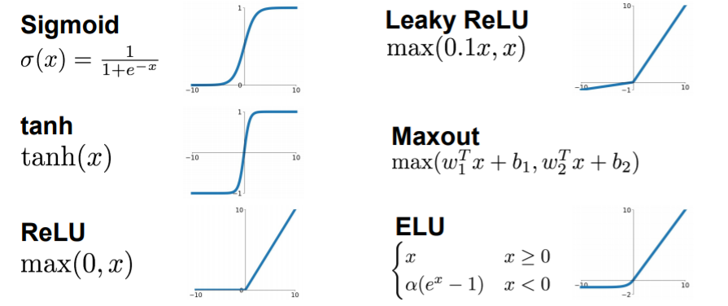
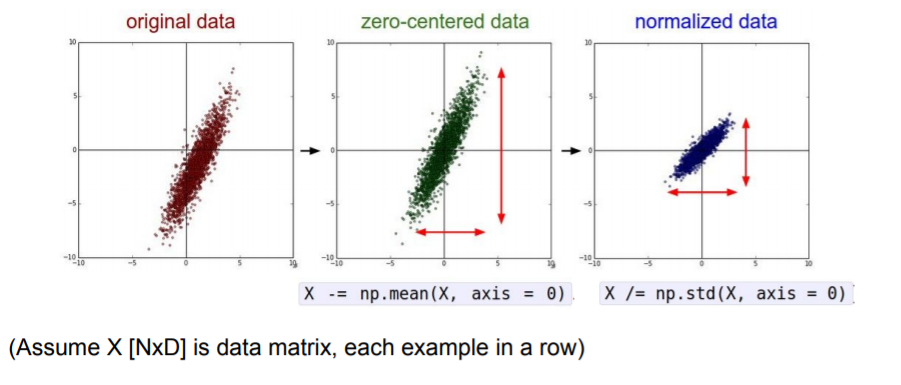
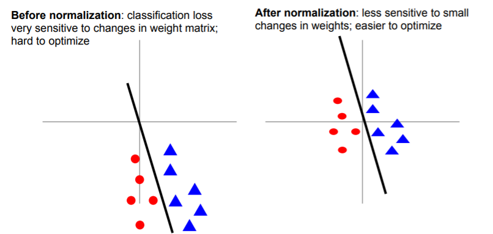
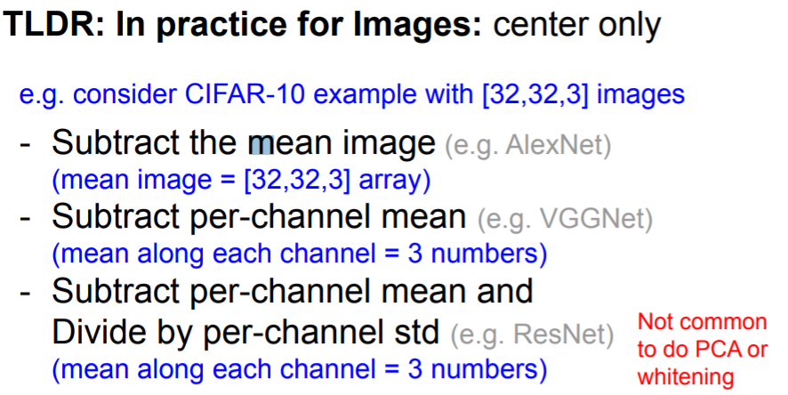
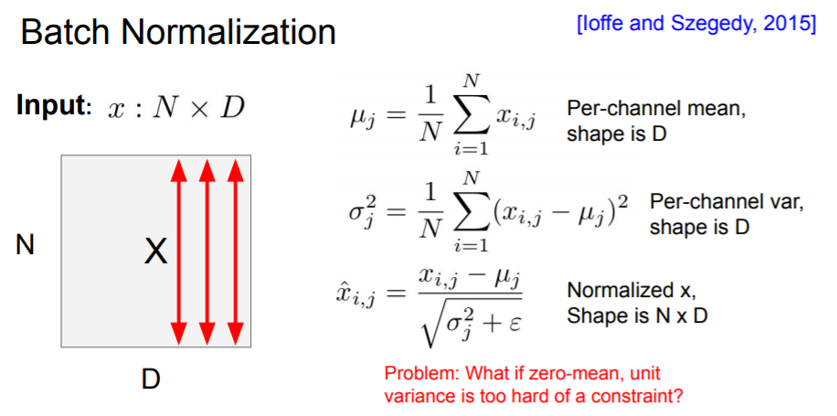
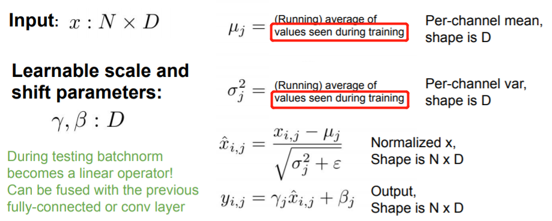
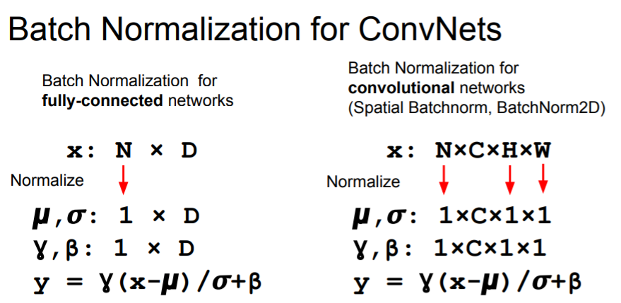
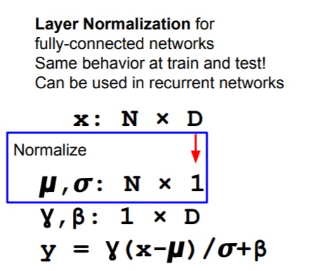
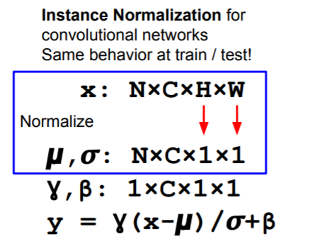
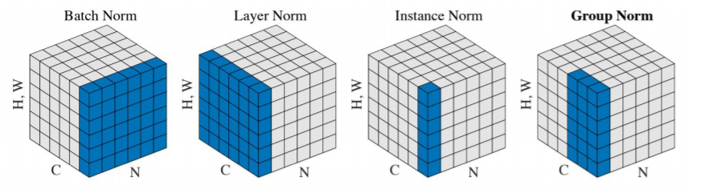

[TOC]

# activation functions

### sigmoid 的问题 (Don’t use sigmoid in practice)

1. Saturated neurons “kill” the gradients：把output压缩到0-1区间对于x=-100/100这种会损失梯度
2. Sigmoid outputs are not zero-centered：output always positive --> gradients always all positive or negative (For a single element! Minibatches help)
3. exp() is a bit compute expensive

### ReLU 的优点

1. Does not saturate (in +region)
2. Very computationally efficient
3. Converges much faster than sigmoid/tanh in practice (e.g. 6x)

### ELU: 似乎更靠谱

1. All benefits of ReLU
2. Closer to zero mean outputs
3. Negative saturation regime compared with Leaky ReLU adds some robustness to noise 

# data preprocessing

> `axis=0` since each example in a row

### Data Normalization

### In practice for Images: center only

# weight initialization

### Interesting Works

1. Fixup Initialization: Residual Learning Without Normalization, Zhang et al, 2019
2. The Lottery Ticket Hypothesis: Finding Sparse, Trainable Neural Networks, Frankle and Carbin, 2019

# Batch Normalization

### BN in test-time

### BN in practice

Usually inserted after Fully Connected or Convolutional layers, and before nonlinearity.

### Layer Normalization

### Instance Normalization

### Group Normalization

# Babysitting the Learning Process

# Hyperparameter Optimization