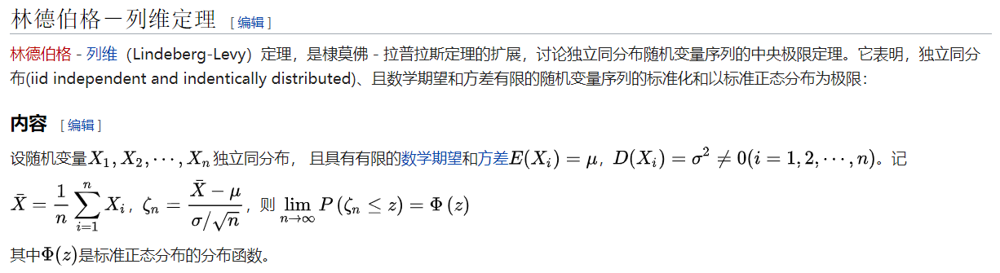
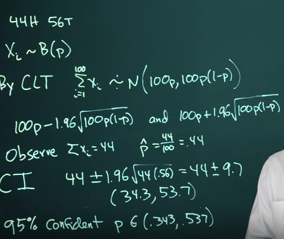
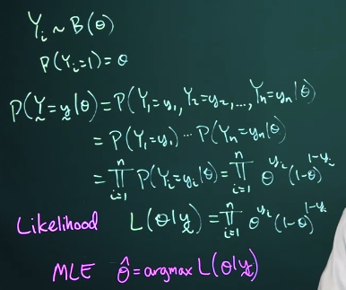
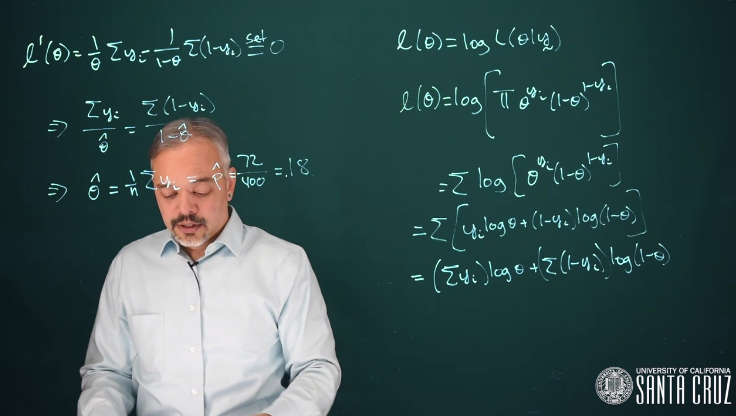
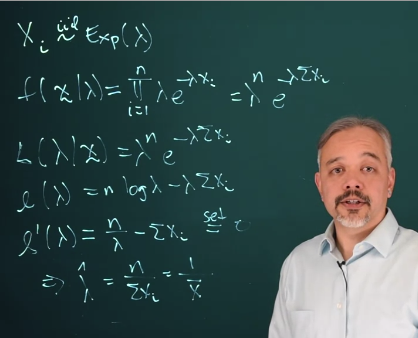
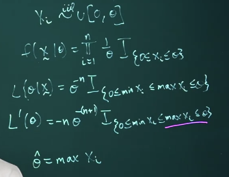

[TOC]

# Background

### Complement

The complement of an event, $A^c$, means that the event does not happen. Since probabilities
must add to one, $P(A^c) = 1 − P(A)$.

### Odds

$$
O(A) = P(A)/P(A^c) = P(A)/(1 − P(A))
$$

### Classical, Frequentist, Bayesian

> **Bayesian Example** You consider results from past elections, factoring in demographic changes as well as your colleague’s appeal in your community before concluding that she has a 3/4 chance of winning an upcoming election.
>
> Analysis:  this probability is based on a synthesis of evidence and personal judgment regarding that evidence.
>
> **Frequentist Example** You survey 100 dental patients and find that 43 have received a filling within the last year. You conclude that the probability of needing a filling in any given year is 0.43.
>
> Analysis: This probability is derived from a relative frequency perspective.

### Conditional probability

$$
P(A|B)=\frac{P(A \and B)}{P(B)}
$$

### Coherence of Probability (whether the bet is fair)

example of incoherence: Dutch book

> 荷兰赌又称“大弃赌”，是“Dutch Book”的英译，意为不论结局怎样都不会输的赌注。比如以1：2的赌注赌黑马赢，同时又以1：3的赌注赌黑马输。如果黑马赢，他输掉一份赌注同时赢得两份赌注，最后还剩一份赌注；如果黑马输，他输掉一份赌注同时赢得三份赌注，最后还剩两份赌注，无论黑马跑赢跑输他都坐赢不输，这就叫荷兰赌。经典荷兰赌论证表明:如果当事人的不确定信念度赋值不满足概率论公理,那么他在某一赌局中总是输。

### Expectation

$$
E[X]= \int_{-\infty}^{\infty} xf(x)dx\\
E[g(X)] = \int_{-\infty}^{\infty} g(x)f(x)dx\\
E[cX] = cE[X] \\
E[X+Y]=E[X]+E[Y] \\
E[XY]=E[X]E[Y] \text{ iff X and Y are independent variables.}
$$

### Bayes' theorem

$$
P(A|B)_\text{(A的后验概率)}=\frac{P(B|A)_\text{似然度}P(A)_\text{先验概率}}{P(B|A)P(A)+P(B|A^c)P(A^c)}
$$

$$
P(A_1|B)=\frac{P(B|A_1)P(A_1)}{\sum_{i=1}^{m}P(B|A_i)P(A_i)}
$$

For continuous distributions, the sum gets replaced with an integral.
$$
f(\theta|y)=\frac{f(y|\theta)f(\theta)}{\int f(y|\theta)f(\theta)d\theta}
$$

### Bernoulli Distribution

$$
X\sim B(p), \text{where }P(x=1)=p\\
$$

$$
f(X=x|p)=f(x|p)=p^x(1-p)^{1-x}I_{x\in\{0,1\}}(x)
$$

$$
E[X]=p, Var[X]=p(1-p)
$$

### Binomial Distribution

$$
X\sim Bin(n,p),\text{ where }P(X=x|p)=f(x|p)=C_n^x \text{ }p^x(1-p)^{n-x} = \begin{pmatrix} n \\ x \end{pmatrix}\text{ }p^x(1-p)^{n-x}\\
x\in\{0,1,2,...,n\}
$$

### Uniform Distribution

$$
f(x)=I_{0\leq x\leq 1}(x)
$$

$$
f(x|\theta_1,\theta_2)=\frac{1}{\theta_2-\theta_1}I_{\{\theta_1 \leq x \leq \theta_2\}}(x)
$$

### Exponential Distribution

$$
f(x|\lambda)=\lambda e^{-\lambda x}, \text{ for x} \geq 0\\
i.e. f(x|\lambda)=\lambda e^{-\lambda x}I_{\{x\geq0\}}(x)\\
$$

$$
E[X]=1/\lambda, Var[X]=1/\lambda^2
$$

### [New] Gamma Function

伽玛函数（Gamma Function）作为阶乘的延拓，是定义在复数范围内的亚纯函数

（0）n为正整数时，gamma函数就是阶乘：(n − 1)!

（1）在实数域上伽玛函数定义为：

（2）在复数域上伽玛函数定义为：($Re(z) > 0$)

### [New] Gamma Distribution

### [New] Beta Distribution

### Normal Distribution

n independent and identically distributed (iid) normal random variables：
$$
\bar{X}\sim N(\mu, \frac{\sigma^2}{n})\\
\frac{\bar{X}-\mu}{\sigma/\sqrt{n}}\sim N(0,1)
$$

### [New] t Distribution

The t distribution is symmetric and resembles the normal distribution, but with thicker tails.
As the degrees of freedom increase, the t distribution looks more and more like the standard
normal distribution.

### 中央极限定理 Central Limit Theorem

中心极限定理是概率论中的一组定理。中心极限定理说明，在适当的条件下，大量相互独立随机变量的均值经适当标准化后依分布收敛于正态分布。这组定理是数理统计学和误差分析的理论基础，指出了大量随机变量之和近似服从正态分布的条件。

---

# 置信区间 Confidence intervals

正态分布的95%置信区间：

> In this example of flipping a coin 100 times, observing 44 heads resulted in the following 95% confidence interval for *p*: (0.343, 0.537). From this we concluded that it is plausible that the coin may be fair because *p*=0.5 is in the interval.
>
> Suppose instead that we flipped the coin 100,000 times, observing 44,000 heads (the same percentage of heads as before). Then using the method just presented, the 95% confidence interval for *p* is (.437, .443). Is it reasonable to conclude that this is a fair coin with 95% confidence?
>
> No. Because .5 is not in the interval, we conclude that *p*=.5 is not a plausible value (not supported by the data). Observing 100,000 flips leads to a precise estimate with a narrow confidence interval, due to the law of large numbers.

Under the Frequentist paradigm, we're assuming that there is a fixed right answer for p, either p is in that interval or it's not in that interval. And so technically, from a frequentist perspective, the probability that p is in this interval is either 0 or 1. This is not a particularly satisfying explanation. 

**In the other hand when we get to the Bayesian approach we will be able to compute an interval and actually say there is probably a p is in this interval is 95% based on a random interpretation of an unknown parameter.**

# Likelihood function and maximum likelihood estimate (MLE)

Consider a hospital where 400 patients are admitted over a month for heart attacks, and a month later 72 of them have died and 328 of them have survived. We can ask, what's our estimate of the mortality rate?

$P(Y=y|\theta)$ is a distribution, $L(\theta|y)$ is a \theta's function.

当然了，似然函数通常计算的是对数。

Take the derivative of log likelihood 可以得到最大似然：

> What is the distinction between $\theta$ and $\hat{\theta}$?
>
> *θ* is the parameter itself, while $\hat{θ}$ is the MLE of \theta.

# Computing the MLE: examples

1. exponential distribution

This makes sense because the mean for an exponential distribution is 1 over lambda. And so if we take 1 over the sample average, we get a maximum likelihood estimate for lambda.

2. Uniform distribution

不需要求对数，因为没有用，直接对似然函数求导就可以，indicator function 保留下来

发现似然函数的导数 always < 0，所以 \theta 的取值越小似然函数值越大。