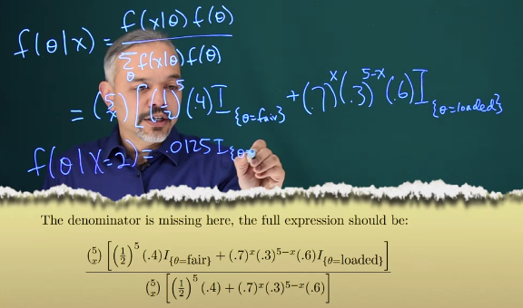
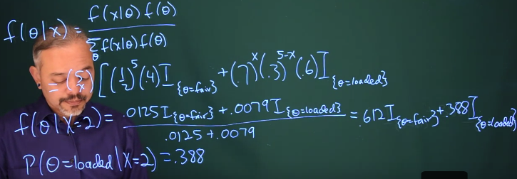

[TOC]

# 5.2 Inference example: Bayesian

掷硬币，硬币是fair or loaded。

suppose Prior $P(loaded)=0.6$

> In this example, what is the interpretation of $P(\theta=\text{loaded})$ ?
>
> Answer: Your "prior" probability that the coin was loaded, before observing any data.
>
> What is the interpretation of $P(\theta=\text{loaded} \mid X=2) $?
>
> Answer: Your "posterior" probability that the coin was loaded, after observing two heads. Observing data helped you "update" your beliefs, going from prior to posterior.

# 5.3 Continuous version of Bayes' theorem

> Why are we allowed to (temporarily) ignore the normalizing constant when finding a posterior distribution?
>
> - [ ] The prior contains the only relevant information about the data y, so that f*(*y) is no longer necessary.
> - [x] The posterior is a PDF of \theta, but \theta does not appear in f(y), so the absence of f(y) does not change the form of the posterior.
> - [ ] If we kept the normalizing constant, it would cancel with the likelihood because they are both probability density functions of the data y.
>
> B. The normalizing constant is just that, some constant number not involving \theta. We can work with the numerator alone because the posterior distribution of \theta is still unique up to a constant.