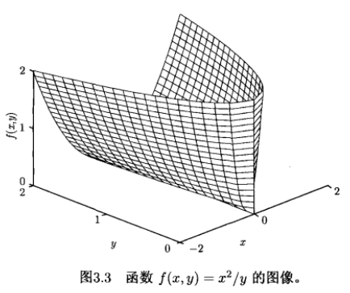
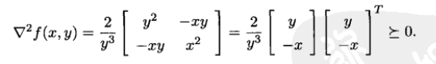
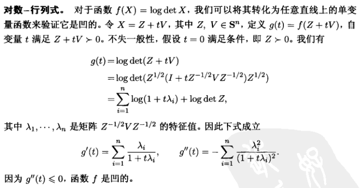
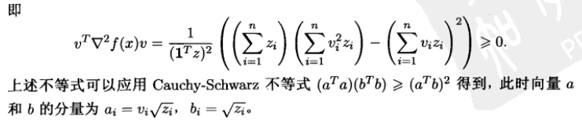

$f: \bf R^n → R$ is convex if $\textbf{ dom } \rm$ $f$ is a convex set and $ f(θx + (1 − θ)y) ≤ θf(x) + (1 − θ)f(y) $ for all $x,y \in \textbf{dom } f, 0 ≤ \theta ≤ 1 $

$f$ is concave if $−f$ is convex

#### 1st-order convex condition

differentiable $f$ with convex domain is convex if and only if 

#### 2nd-order convex condition

differentiable $f$ with convex domain is convex if and only if  $\nabla^2f(x) \geq 0 \text{ for all }x \in \bf dom \rm \text{ f}$

#### Examples

Examples of convex on $\bf R$:

- affine: ax + b on R, for any a,b ∈ R

- exponential: $e^{ax}$ , for any a ∈ R

- powers: $x^α$ on $\bf R_{++}$ , for α ≥ 1 or α ≤ 0

  > $\bf R_{++} = (0, \infty)$

- powers of absolute value: $|x|^p$ on R, for p ≥ 1

- negative entropy: $x\log x$ on $\bf R_{++} \rm$

Examples of concave on $\bf R $:

- affine: ax + b on R, for any a,b ∈ R
- powers: $x^α$ on $\bf R_{++} \rm$ , for 0 ≤ α ≤ 1
- logarithm: $\log x$ on $\bf R_{++} \rm$

Examples of convex on $\bf R \rm ^n$:

-  affine function: $f(x) = a^Tx+b$

  > affine functions are convex and concave

- norms: $||x||_p = (\sum_{i=1}^n|x_i|^p)^{\frac{1}{p}}$ for $p \geq 1$

  > all norms are convex
  >
  > $||x||_{\infty} = \text{ max}_k |x_k| $ is convex.

- 指数和的对数: $f(x) = \log (e^{x_1}+...+e^{x_n})$ 在 $\bf R^n$ 上是凸函数. 这个函数是最大值函数的**近似**

  > $\max\{x_1,..., x_n\} \leq f(x) \leq \max\{x_1, ..., x_n\} + \log n$, 而 $\max\{x_1,..., x_n\}$ 是凸函数.
  >
  > 中文译本教材81页给出了该函数的凸证明, 用了Hessian矩阵法

#### [Important] Examples of convex on $\bf R \rm ^{m \times  n}$:

- affine function: $f(X) = \bf{tr} \rm (A^Tx)+b = \sum_{i=1}^m \sum_{j=1}^n A_{ij}X_{ij} + b$

- spectral (maximum singular value) norm: $f(X) = ||X||_2 = \sigma_{max}(X) = (\lambda_{max}(X^TX))^{\frac{1}{2}}$

#### [Important] 证明函数是凸函数

- 直接验证定义

- 验证其Hessian矩阵是否半正定 (如果二阶可微)

  > 为了证明 Hessian 矩阵非负, 需要证明对任意$v$, $v^T\nabla^2f(x)v \geq 0$

Example: $f(x,y) = \frac{x^2}{y}, \bf dom \rm f = \{ (x,y) \in \bf R^2 \rm | y > 0\}$ 是凸函数

Example: $f(X)=\log \det X$, 我们可以将其**转化为任意直线上的单变量函数来验证它是凸的**

不失一般性, 假设 $ Z \in S^n_{++} \text{ i.e., P symmetric positive definite)} $

> 没有看懂这里的操作

#### log-sum-exp (softmax function) is CONVEX!

$$
f(x) = \log \sum_{k=1}^{n} \exp x_k
$$

> 这个函数很重要, 因为 "It is a smooth approximation of maximum." "Another name of this function is SOFTMAX", "accentuate (强调, 突出) large numbers"

log-sum-exp Hessian: Suppose  $z = (\exp x_1, \exp x_2,..., \exp x_n)$, then $f(x)=\log 1^Tz$
$$
\frac{\partial}{\partial x_j} f(x) =\frac{\partial f}{\partial z_j}\frac{\partial z_j}{\partial x_j} = \frac{\partial}{\partial z_j} \log 1^Tz \cdot \frac{\partial z_j}{\partial x_j} = \frac{z_j}{1^Tz} 
$$

$$
\begin{align*} \frac{\partial^2 f}{\partial x_i \partial x_j} 
  &= \frac{\partial}{\partial z_i} \left(\frac{z_j}{1^Tz}\right) \cdot \frac{\partial z_i}{\partial x_i}\\
  &= \frac{\delta_{ij}1^Tz - z_j}{(1^T z)^2} \cdot z_i\\
  &(\text{Note that }\delta_{ij}=1 \text{ iff } i=j, \text{ else } =0)\\
  &(\text{Meanwhile, } \frac{\partial (1^Tz)}{\partial z_i} = 1)\\
  &= \frac{\delta_{ij}z_i\cdot 1^Tz - z_iz_j}{(1^T z)^2}\\
  &= \frac{\delta_{ij}z_i}{1^Tz} - \frac{z_iz_j}{(1^Tz)^2}\\
  &= \left(\frac 1{1^Tz} \mathop{\rm diag}(z) - \frac{1}{(1^Tz)^2} zz^T\right)_{i,j}
 \end{align*}
$$

$$
\text{Thus, } \nabla^2f(x)=\frac{1}{(\bf 1 \rm^Tz)^2}((\bf 1 \rm^Tz)\bf diag \rm(z)-zz^T)
$$

为了证明 Hessian 矩阵非负, 需要证明对任意$v$, $v^T\nabla^2f(x)v \geq 0$

> 柯西施瓦茨不等式: 对欧几里得空间$R^n$, 
> $$
> (\sum_{i=1}^{n}x_iy_i)^2 \leq (\sum_{i=1}^{n}x_i^2)(\sum_{i=1}^{n}y_i^2)
> $$

# Jenson's Inequality

- [function] if f is convex, then for 0 ≤ θ ≤ 1, $f(θx + (1 − θ)y) ≤ θf(x) + (1 − θ)f(y)$
- [probability]  if f is convex, then $f(\bf E \rm z) ≤ \bf E \rm f(z)$ for any random variable z

# Operations that preserve convexity

show that $f$ is obtained from simple convex functions by operations that preserve convexity

- nonnegative weighted sum

- composition with affine function

- pointwise maximum

  - **Definition**: If $f_1 (x),...,f_m (x)$ are convex, then $f(x) = \max \{f_1 (x),...,f_m (x)\}$
  - piecewise-linear function 分段线性函数:  $\max_{i=1,...,m} (a^T_i x + b_i )$ is convex
  - sum of $r$ largest components of $x \in R^n$: $f(x)=x_{[1]}+x_{[2]}+...+x_{[r]}$ is convex
    - Proof: $f(x) = \max \{x_{i_1} + x_{i_2} + ··· + x_{i_r}| 1 ≤ i_1 < i_2 < ··· < i_r ≤ n \}$

- pointwise supremum

  - **Definition**: if $f(x,y)$ is convex in $x$ for each $y ∈ A$, then $g(x) = \sup_{y∈A} f(x,y)$ is convex
  - maximum eigenvalue of symmetric matrix: for $X \in \bf S \rm^n, \lambda_{\max}=\sup_{||y||_2=1} y^T\bf X \rm y$
    - Hint: $y^T\bf X \rm y$ is linear.

- composition with scalar functions

  - **Definition**: f(x) = h(g(x)),  f is convex if: 

    - g convex, h convex, $\tilde{h}$ nondecreasing
    - g concave, h convex, $\tilde{ h }$ nonincreasing

    > extended-value extension $\tilde{f}$ of $f$ is: $\tilde{f}(x) = f(x), x \in \textbf{dom }\rm f, \tilde{f}(x) = \infty, x \notin \textbf{dom }f$

  - $\exp g(x)$ is convex if $g$ is convex

  - $1/g(x)$ is convex if $g$ is concave and positive

- composition with vector

- minimization

- perspective