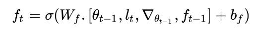
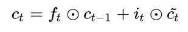
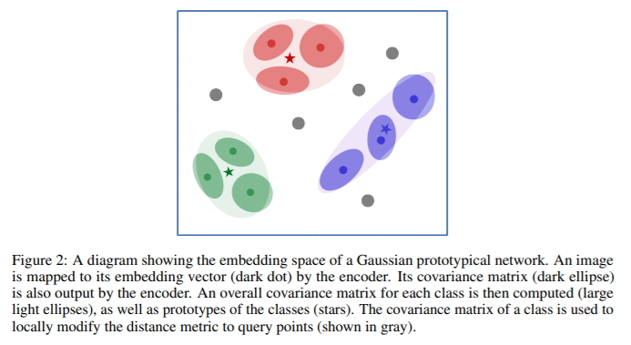
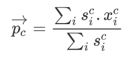
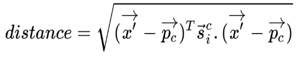

[TOC]

# 1. Overview

Meta Learning 有三个方向：

- Learning the metric space
  - 学习不同任务/度量空间 Metirc Space 之间的相似性
  - 例如 Siamese networks, prototypical networks, and relation networks. 
- Learning the initializations
  - 学习如何不通过梯度下降，从而直接找到optimal weight的方法
  - MAML, Reptile, and Meta-SGD 
- Learning the optimizer
  - 在Few-shot学习中，GD是没法用的
  - In this case, we will learn the optimizer itself. **We will have two networks: a base network that actually tries to learn and a meta network that optimizes the base network. **

## 1.1 Learning to learn gradient descent by gradient descent

对应了 Learning the optimizer 的范畴，meta net 是一个RNN。

Our optimizee (base network) is optimized through our optimizer (RNN, optimized by gradient descent)。

Optimizer RNN的损失函数：
$$
L(\phi)=\mathbb{E}_f[f(\theta(f,\phi))]\\
$$

> Loss = Average Loss of the optimizee (base network)
>
> \phi for RNN params, \theta for base network f 's params

Optimizer RNN的参数更新（梯度下降法）：
$$
(g_t,h_{t+1}) =m(\nabla_t, h_t, \phi)
$$

- RNN的输入：
  - \nabla_t: 在t时刻，optimizee 执行support set 的某任务时，损失函数计算出来的梯度。也就是说，$\nabla_t = \nabla_{t} f(\theta_t)$

  - h_t: 当前RNN的hidden state

  - \phi: 当前RNN的参数

- RNN的输出：
  - g_t: 代替GD，给 optimizee 更新的梯度，从而使 $\theta_{t+1} = \theta_t + g_t$

  - h_{t+1}: next state of RNN

## 1.2 Optimization as a model for few-shot learning

对于Few-shot Learning，用LSTM可以替代GD，以LSTM的cell直接作为base network update，也不需要 learning rate 了。

对于LSTM的forget gate:



对于LSTM的input gate:


LSTM的cell:



# 2. Face and Audio Recognition Using Siamese Networks （Python）

## 孪生网络

两个网络的结构和参数完全相同，对不同的输入会前向输出不同的embedding（feature vector），特征向量的相似性反映了输入的相似性。

相似性判断函数被称为 energy function，常见的有欧氏距离和余弦相似度。

孪生网络输入：The input to the siamese networks should be in pairs, **(X1, X2)**, along with their binary label, **Y ∈ (0, 1)**, stating whether the input pairs are a **genuine pair (same)** or an **imposite pair (different)**.  

孪生网络损失函数：
$$
\text{Contrasive Loss} = Y(E)^2+(1-Y)\max(margin-E, 0)^2
$$

- The term **margin **is used to hold the constraint, that is, when two input values are dissimilar, and if their distance is greater than a margin, then they do not incur a loss. 

# 3. Prototypical Networks and Their Variants

## 原型聚类算法（西瓜书）

原型聚类算法假设聚类结构可以通过一组原型刻画。通常情形下，算法先对原型进行初始化，然后对原型进行迭代更新求解。常见的原型聚类算法为K-means。

## 原型网络

官方torch代码: [Github Here](https://github.com/orobix/Prototypical-Networks-for-Few-shot-Learning-PyTorch/blob/master/src/train.py )

常用在few-shot的分类任务中。

用CNN提取图片的特征，对同一个类别的特征向量取均值作为整个类的 class prototype。

对于query data，计算其特征与各个class prototype的欧氏距离，softmax to this distance and get the probabilities.  

与典型的深度学习体系结构不同，原型网络不直接对图像进行分类，而是通过在度量空间中寻找图像之间的映射关系。原型网络中将图像映射到度量空间的基础模型可以被称为"Image2Vector"模型，这是一种基于卷积神经网络 （CNN） 的体系结构。 

损失函数：


TF代码实现：

```python
embedding_dimension = tf.shape(support_set_embeddings)[-1] 
# support_set_embeddings是卷积网络flatten之后的输出
# embedding_dimension是人为设置的，e.g. 64, 128...

class_prototype = tf.reduce_mean(tf.reshape(support_set_embeddings, 
                                            [num_classes, 
                                             num_support_points, 
                                             embedding_dimension]), 
                                 axis=1)

distance = euclidean_distance(class_prototype,
                              query_set_embeddings)

predicted_probability = tf.reshape(tf.nn.log_softmax(-distance), 
                                   [num_classes, num_query_points, -1])

loss = -tf.reduce_mean(tf.reshape(tf.reduce_sum(tf.multiply(y_one_hot,
                                                            predicted_probability),
                                                axis=-1), 
                                  [-1]))
```

## Gaussian prototypical network

尽管**原型网络**产生了非常好的成果，但仍然有一些局限性。第一个问题是**缺乏泛化**。原型网络在Omniglot 数据集上表现的很好，因为数据集中的所有图像都是一个字符的图像，因此具有一些相似的特征。然而，如果我们尝试利用这个模型来对不同种类的猫进行分类，它就不会给我们准确的结果了。猫和字符图像之间具有较少的共性，可用于将图像映射到相应度量空间的常见特征数量几乎是可以忽略不计的。

原型网络的另一个局限性是它们只使用平均值来确定中心，而**忽略了支持数据集的方差**。这就阻碍了当图像有噪音的时候模型的分类能力。这一限制是通过使用高斯原型网络（https://arxiv.org/abs/1708.02735）来克服的，它利用了类中的方差，通过使用高斯公式对嵌入点进行建模。



So, in Gaussian prototypical networks, the output of the encoder will be embeddings（这点和传统原型网络相同）, as well as the covariance matrix（协方差矩阵）. Instead of using the full covariance matrix, we either include a radius or diagonal component from the covariance matrix along with the embeddings: 

- **Radius component:** If we use the radius component of the covariance matrix, then the dimension of our covariance matrix would be 1, as the radius is just a single number.
- **Diagonal component**: If we use the diagonal component of the covariance matrix, then the dimension of our covariance matrix would be the same as the embedding matrix dimension.

Also, instead of using the covariance matrix directly, we use the inverse of a covariance matrix.

协方差矩阵转换为反协方差矩阵的方法有：

- *S = 1 + Softplus(S_{raw})*，其中 y = log(1 + e^x)
- *S = 1 + sigmoid(S_{raw})*
- *S = 1+ 4 \* sigmoid(S_{raw})*
- *S = offset + scale \* softplus(S_{raw}/div),* where *div, offset* and *scale* are trainable parameters

如何把协方差矩阵编码到prototype中呢？对于类别c，prototype的计算公式：



度量函数：



## Semi-Prototypical Networks (To compute the class prototypes of these unlabeled data points)

https://arxiv.org/pdf/1803.00676.pdf 

对于无标签的数据样本，我们不能粗暴地将其划分到已有的类别里面，因为存在**部分无标签样本的真实类别不在已有类别之中**的情况，所以需要开第N+1个类别，叫"distractor class"。

半监督原型网络实现: 

- compute the normalized distance between unlabeled examples in the unlabeled set *R* to all of the class prototypes. 
- compute the threshold for each class prototype by feeding various statistics of the normalized distance, such as min, max, skewness（偏态）, and kurtosis（峰度）, to a neural network. 
  - 在统计学中，峰度（Kurtosis）衡量实数随机变量概率分布的峰态。峰度高就意味着方差增大是由低频度的大于或小于平均值的极端差值引起的。
  - 正态分布的偏度为0，两侧尾部长度对称。若以bs表示偏度。bs<0称分布具有负偏离，也称左偏态，此时数据位于均值左边的比位于右边的少，直观表现为左边的尾部相对于与右边的尾部要长，因为有少数变量值很小，使曲线左侧尾部拖得很长；bs>0称分布具有正偏离，也称右偏态，此时数据位于均值右边的比位于左边的少，直观表现为右边的尾部相对于与左边的尾部要长，因为有少数变量值很大，使曲线右侧尾部拖得很长；而bs接近0则可认为分布是对称的。
  - to a neural network 是啥意思？
- Based on this threshold, we add or ignore the unlabeled examples to the class prototypes. 

# 4. Relation and Matching Networks Using TensorFlow

## 4.1 Relation networks in one-shot learning


## 4.2 Relation networks in few-shot learning


## 4.3 Relation networks in zero-shot learning