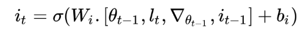

[TOC]

# 1. Overview

Meta Learning 有三个方向：

- Learning the metric space
  - 学习不同任务/度量空间 Metirc Space 之间的相似性
  - 例如 Siamese networks, prototypical networks, and relation networks. 
- Learning the initializations
  - 学习如何不通过梯度下降，从而直接找到optimal weight的方法
  - MAML, Reptile, and Meta-SGD 
- Learning the optimizer
  - 在Few-shot学习中，GD是没法用的
  - In this case, we will learn the optimizer itself. **We will have two networks: a base network that actually tries to learn and a meta network that optimizes the base network. **

## 1.1 Learning to learn gradient descent by gradient descent

对应了 Learning the optimizer 的范畴，meta net 是一个RNN。

Our optimizee (base network) is optimized through our optimizer (RNN, optimized by gradient descent)。

Optimizer RNN的损失函数：
$$
L(\phi)=\mathbb{E}_f[f(\theta(f,\phi))]\\
$$

> Loss = Average Loss of the optimizee (base network)
>
> \phi for RNN params, \theta for base network f 's params

Optimizer RNN的参数更新（梯度下降法）：
$$
(g_t,h_{t+1}) =m(\nabla_t, h_t, \phi)
$$

- RNN的输入：
  - \nabla_t: 在t时刻，optimizee 执行support set 的某任务时，损失函数计算出来的梯度。也就是说，$\nabla_t = \nabla_{t} f(\theta_t)$

  - h_t: 当前RNN的hidden state

  - \phi: 当前RNN的参数

- RNN的输出：
  - g_t: 代替GD，给 optimizee 更新的梯度，从而使 $\theta_{t+1} = \theta_t + g_t$

  - h_{t+1}: next state of RNN

## 1.2 Optimization as a model for few-shot learning

对于Few-shot Learning，用LSTM可以替代GD，以LSTM的cell直接作为base network update，也不需要 learning rate 了。

对于LSTM的forget gate:


对于LSTM的input gate:



LSTM的cell:


# 2. Face and Audio Recognition Using Siamese Networks （Python）

## 孪生网络

两个网络的结构和参数完全相同，对不同的输入会前向输出不同的embedding（feature vector），特征向量的相似性反映了输入的相似性。

相似性判断函数被称为 energy function，常见的有欧氏距离和余弦相似度。

孪生网络输入：The input to the siamese networks should be in pairs, **(X1, X2)**, along with their binary label, **Y ∈ (0, 1)**, stating whether the input pairs are a **genuine pair (same)** or an **imposite pair (different)**.  

孪生网络损失函数：
$$
\text{Contrasive Loss} = Y(E)^2+(1-Y)\max(margin-E, 0)^2
$$

- The term **margin **is used to hold the constraint, that is, when two input values are dissimilar, and if their distance is greater than a margin, then they do not incur a loss. 

# 3. Prototypical Networks and Their Variants

## 3.1 原型聚类算法（西瓜书）

原型聚类算法假设聚类结构可以通过一组原型刻画。通常情形下，算法先对原型进行初始化，然后对原型进行迭代更新求解。常见的原型聚类算法为K-means。

## 3.2 原型网络

官方torch代码: [Github Here](https://github.com/orobix/Prototypical-Networks-for-Few-shot-Learning-PyTorch/blob/master/src/train.py )

常用在few-shot的分类任务中。

用CNN提取图片的特征，对同一个类别的特征向量取均值作为整个类的 class prototype。

对于query data，计算其特征与各个class prototype的欧氏距离，softmax to this distance and get the probabilities.  

与典型的深度学习体系结构不同，原型网络不直接对图像进行分类，而是通过在度量空间中寻找图像之间的映射关系。原型网络中将图像映射到度量空间的基础模型可以被称为"Image2Vector"模型，这是一种基于卷积神经网络 （CNN） 的体系结构。 

损失函数：


TF代码实现：

```python
embedding_dimension = tf.shape(support_set_embeddings)[-1] 
# support_set_embeddings是卷积网络flatten之后的输出
# embedding_dimension的shape是人为设置的，e.g. 64, 128...

class_prototype = tf.reduce_mean(tf.reshape(support_set_embeddings, 
                                            [num_classes, 
                                             num_support_points, 
                                             embedding_dimension]), 
                                 axis=1)

distance = euclidean_distance(class_prototype,
                              query_set_embeddings)

predicted_probability = tf.reshape(tf.nn.log_softmax(-distance), 
                                   [num_classes, num_query_points, -1])

loss = -tf.reduce_mean(tf.reshape(tf.reduce_sum(tf.multiply(y_one_hot,
                                                            predicted_probability),
                                                axis=-1), 
                                  [-1]))
```

## 3.3 Gaussian prototypical network

尽管**原型网络**产生了非常好的成果，但仍然有一些局限性。第一个问题是**缺乏泛化**。原型网络在Omniglot 数据集上表现的很好，因为数据集中的所有图像都是一个字符的图像，因此具有一些相似的特征。然而，如果我们尝试利用这个模型来对不同种类的猫进行分类，它就不会给我们准确的结果了。猫和字符图像之间具有较少的共性，可用于将图像映射到相应度量空间的常见特征数量几乎是可以忽略不计的。

原型网络的另一个局限性是它们只使用平均值来确定中心，而**忽略了支持数据集的方差**。这就阻碍了当图像有噪音的时候模型的分类能力。这一限制是通过使用高斯原型网络（https://arxiv.org/abs/1708.02735）来克服的，它利用了类中的方差，通过使用高斯公式对嵌入点进行建模。


So, in Gaussian prototypical networks, the output of the encoder will be embeddings（这点和传统原型网络相同）, as well as the covariance matrix（协方差矩阵）. Instead of using the full covariance matrix, we either include a radius or diagonal component from the covariance matrix along with the embeddings: 

- **Radius component:** If we use the radius component of the covariance matrix, then the dimension of our covariance matrix would be 1, as the radius is just a single number.
- **Diagonal component**: If we use the diagonal component of the covariance matrix, then the dimension of our covariance matrix would be the same as the embedding matrix dimension.

Also, instead of using the covariance matrix directly, we use the inverse of a covariance matrix.

协方差矩阵转换为反协方差矩阵的方法有：

- *S = 1 + Softplus(S_{raw})*，其中 y = log(1 + e^x)
- *S = 1 + sigmoid(S_{raw})*
- *S = 1+ 4 \* sigmoid(S_{raw})*
- *S = offset + scale \* softplus(S_{raw}/div),* where *div, offset* and *scale* are trainable parameters

如何把协方差矩阵编码到prototype中呢？对于类别c，prototype的计算公式：


度量函数：


## 3.4 Semi-Prototypical Networks (To compute the class prototypes of these unlabeled data points)

https://arxiv.org/pdf/1803.00676.pdf 

对于无标签的数据样本，我们不能粗暴地将其划分到已有的类别里面，因为存在**部分无标签样本的真实类别不在已有类别之中**的情况，所以需要开第N+1个类别，叫"distractor class"。

半监督原型网络实现: 

- compute the normalized distance between unlabeled examples in the unlabeled set *R* to all of the class prototypes. 
- compute the threshold for each class prototype by feeding various statistics of the normalized distance, such as min, max, skewness（偏态）, and kurtosis（峰度）, to a neural network. 
  - 在统计学中，峰度（Kurtosis）衡量实数随机变量概率分布的峰态。峰度高就意味着方差增大是由低频度的大于或小于平均值的极端差值引起的。
  - 正态分布的偏度为0，两侧尾部长度对称。若以bs表示偏度。bs<0称分布具有负偏离，也称左偏态，此时数据位于均值左边的比位于右边的少，直观表现为左边的尾部相对于与右边的尾部要长，因为有少数变量值很小，使曲线左侧尾部拖得很长；bs>0称分布具有正偏离，也称右偏态，此时数据位于均值右边的比位于左边的少，直观表现为右边的尾部相对于与左边的尾部要长，因为有少数变量值很大，使曲线右侧尾部拖得很长；而bs接近0则可认为分布是对称的。
  - to a neural network 是啥意思？
- Based on this threshold, we add or ignore the unlabeled examples to the class prototypes. 

# 4. Relation and Matching Networks

## 4.1 Relation Network (Encoder + Feature Concatenation, One/Few/Zero-shot Learning)

之前的few-shot工作都是预先指定好度量方式的，如欧式距离或余弦距离，学习部分主要体现在特征嵌入方面，但是该论文同时学习了特征的嵌入及非线性度量矩阵（相似度函数），这些都是端到端的调整。通过学习到的相似性矩阵有着比人为选定的矩阵更具有灵活性，更能捕获到特征之间的相似性。 


经过 concatenation function Z 之后，再用关系函数 r_{ij} 确定当前样本预测类别 i 与 j 的相似程度：


在 zero-shot learning 中，虽然没有训练样本x_i，但是有meta information v_c，所以也可以用relation network：


损失函数为均方误差，当回归问题处理。

> 以下内容摘自：[原作者介绍](https://zhuanlan.zhihu.com/p/35379027 )
>
> 我们把输出的relation score看做是一个从0到1的数值。0就代表极不相似，而1则代表完全相似。因此，我们就非常直接的采用平方差MSE作为网络训练的loss。 
>
> 只做少样本学习不是这个模型的全部，我们很容易的把它做一些改变，就能直接用于零样本学习。零样本学习和少样本学习不一样的地方在于零样本学习不给样本，而是给出一个代表某一类物体语义的嵌入向量，我们要直接利用这个嵌入向量来对物体做分类。那么，在我们的关系网络中，我们只需要把训练样本（support set）改成这个语义嵌入向量就可以来做零样本学习了。 

## 4.2 Matching Network (One-shot Learning, Google DeepMind)


对于support set point 和 query set point 用的是两种 encoder：f & g。

a 是一种注意力机制（attention matrix）。

y 是对 support set point label 的独热编码。


原论文中，support set encoder **g** 是双向LSTM，query set encoder **f** 是LSTM。 

> 以下内容摘自：[别人的paper-notes](https://zhuanlan.zhihu.com/p/32101204 )
>
> 有人可能会疑惑为什么要用LSTM，像LSTM、RNN这种模型都要记住一些东西，可是这些样本的类别又不同，所以是想要记住什么？我的理解是将各个类别的样本作为序列输入到LSTM中，是为了模型纵观所有的样本去自动选择合适的特征去度量。
>
> 对测试集进行编码的公式：(3-6)是 attLSTM 的搭建方法
>
> 
>
> K代表迭代了K次。

---

> 以下内容摘自：[Karpthy的github.io](https://github.com/karpathy/paper-notes/blob/master/matching_networks.md)，强调了样本顺序的重要性。
>
> It's odd that the **order** is not mentioned, I assume it's random? This is a bit gross because order matters to a bidirectional LSTM; you'd get different embeddings if you permute the examples. 

---

在 [./codes/matchingNet.py ](./codes/matchingNet.py)中，我记录了repo：[PyTorch 实现 Matching Network](https://github.com/gitabcworld/MatchingNetworks/blob/master/models/MatchingNetwork.py) 的代码笔记，与原文有些许不同，这位开发者将 f 和 g 用同一个网络进行编码（CNN+LSTM）。


# 5. Memory-Augmented Neural Networks (MAML)

## 5.1 Neural Turing Machine

 神经图灵机的本质是一个 **使用外部存储矩阵** 进行 **attentive interaction** 机制的RNN。


**不可以用index**去获取存储矩阵的某个值，因为离散的index不可导，不能用梯度下降法。

于是设计读写操作：假如把记忆看作是一个 **N×M** 的矩阵M_t，t表示当前时刻，表示记忆会随着时间发生变化。

---

### 5.1.1 读操作：注意力机制


我们的读过程就是生成一个定位权值向量 w_t，长度为N，表示N个位置对应的记忆权值大小，最后读出的记忆向量 r_t 为：
$$
r_t= \sum_i^N w_t(i) M_{t}(i) \text{ (注意力机制), 其中 }\sum_iw_t(i)=1
$$

---

### 5.1.2 写操作 (以下摘自[CSDN](https://blog.csdn.net/ppp8300885/article/details/80383246 ))

神经图灵机的写过程参考了LSTM的门的概念：先用输入门决定增加的信息，再用遗忘门决定要丢弃的信息，最后用更新门加上增加的信息并减去丢弃的信息。具体来说，神经图灵机会生成一个**擦除向量** e_t (erase vector) 和一个**增加向量** a_t (add vector)，长度都为N，向量中每个元素的值大小范围从0到1，表示要增加或者删除的信息。对于写记忆过程，神经图灵机首先执行一个擦除操作，擦除程度的大小同样由向量 w_t 决定：
$$
M_t'(i)=M_{t-1}(i)(1-w_t(i)e_t(i))
$$
这个操作表示从t−1时刻的记忆中丢弃了一些信息，若 w_t 和 e_t 同时为0，则表示记忆没有丢弃信息，当前记忆与t−1时刻保持不变。

执行完擦除后，然后执行增加操作：
$$
M_t(i)=M'_t(i)+w_t(i)a_t(i)
$$
这步表示在丢弃一些信息后需要新增的信息，同样，若 w_t ​和 a_t ​都为0，表示当前记忆无新增，与擦除后的记忆保持一致。

e_t ​和 a_t ​都是由控制器给出，而控制器基本上由神经网络实现，可以是LSTM，也可以是MLP。

由于整个过程都是都是矩阵的加减乘除，所有的读写操作都是可微分的，因此我们可以用梯度下降法训练整个参数模型。但是接下来，我们需要确定 w_t 定位向量，由于这个向量直接决定着当前输入与记忆的相关性，因此神经图灵机在生成 w_t 向量上做了很多工作。

---

### 5.1.3 寻址：训练合适的weight vector (鸽)

#### A. Content-based Addressing

#### B. Location-based Addressing

##### B.1 Interpolation

##### B.2 Convolution Shift

##### B.3 Sharpening

##### B.4 代码实现

---

