##### Definition of Optimization problem

$x$: decision variable

$f_0$: objective or cost function

$f_i$: inequality constraint functions (subject to $f_i(x) \leq 0$)

$h_i$: equality constraint functions

> 如果是$\max f_0(x)$, 此时$f_0$ 通常称为 **profit 或者 utility**

##### optimal value 最优值

$p^* = \inf \{f_0 (x) | f_i (x) ≤ 0, i = 1,...,m, h_i (x) = 0, i = 1,...,p\}$

>  $\inf (0,1] = 0$, $\inf \empty= \infty$

- $p^* = ∞$ if problem is infeasible (no x satisfies the constraints)
- $p^* = −∞$ if problem is unbounded below, referred to as Euphoric Breakdown

**对于一个凸问题, any locally optimal point of a convex problem is (globally) optimal**

##### 可行性问题 Feasibility problem

> 如果目标函数$f_0(x)$ 恒等于零，那么最优解要么是0(如果可行集非空), 要么是$\infty$ (如果可行集是空集). 因此可行性问题可以用来判断约束是否一致，如是，则找到一个满足它们的点

# Standard Form Convex Opt Problem

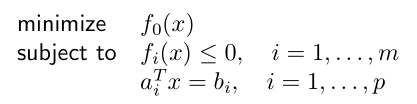

等价表示:

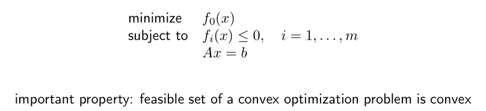

其中 f_0 , f_1 , . . . , f_m are convex; equality constraints are affine

1. Optimality criterion for differentiable $f_0$

   > x is optimal if and only if it is feasible and $\nabla f_0(x)^T(y-x) \geq 0$ for all feasible y.
   >
   > if nonzero, $\nabla f_0 (x)$ defines a **supporting hyperplane** to feasible set $X$ at $x$

2. unconstrained problem **没有约束条件的优化问题**

   > x is optimal if and only if $x \in  \textbf{dom } \rm f_0$, $\nabla f_0(x)=0$
   >
   > a problem is unconstrained if it has no explicit constraints (m = p = 0), 也就是没有$\textbf{subject to }$ 这个部分.

3. equality constrained problem **只有等式约束的优化问题**, minimize f_0 (x) subject to Ax = b

   > x is optimal if and only if there exists a ν such that:
   >
   > - x ∈ dom f_0 , Ax = b,
   > - $\nabla f_0(x)+A^Tv=0$ 

4. minimization over nonnegative orthant (象限), **只有不等式条件约束的优化问题**, minimize f_0 (x) subject to x \geq 0

   > x is optimal if and only if
   >
   > - $x \in \textbf{dom } \rm f_0$
   > - $x \geq 0$
   > - $\begin{equation}  
   >   \left\{  
   >   \begin{array}{**lr**}  
   >   \nabla f_0(x)_i \geq 0 & x_i=0 \\
   >   \nabla f_0(x)_i = 0 & x_i>0
   >   \end{array}  
   >   \right.  
   >   \end{equation}$

# Equivalent Convex Problems

| Type                                                | Problem          | Equivalent Form                                              |
| --------------------------------------------------- | ---------------- | ------------------------------------------------------------ |
| eliminating equality constraints                    |   | 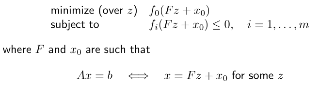                                              |
| introducing equality constraints                    | 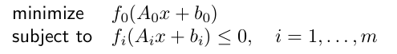 | 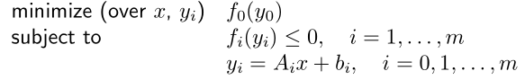                                             |
| introducing slack variables for linear inequalities | 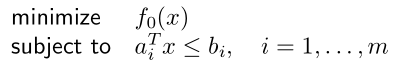 | 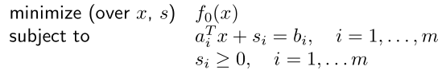                                             |
| epigraph form                                       |   | 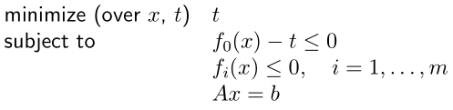                                             |
| minimizing over multiple variables                  | 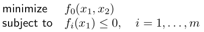 | 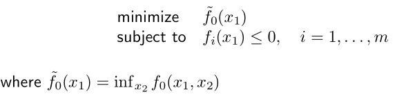                                             |
| **Quasiconvex optimization**                        |   | f_0 : R^n \rightarrow R quasiconvex, f_1 , . . . , f_m convex, we can have locally optimal points that are not (globally) optimal. |

> Quasiconvex functions
>
> $f : R^n \rightarrow R$ is quasiconvex if 
>
> - dom f is convex 
> - the sublevel sets $S_α = \{x \in \textbf{dom } f | f(x) ≤ \alpha \}$ are convex for all $\alpha$

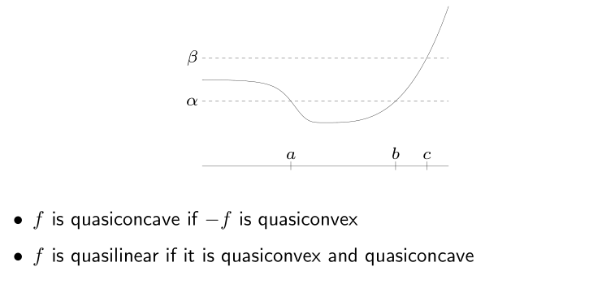

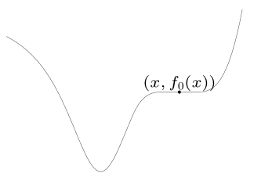

# Linear Program (LP)

$$
\text{minimize }  c^T x + d\\
\text{subject to } Gx \leq h, Ax=b
$$

目标函数和约束等式/不等式都是线性的 (convex problem with affine objective and constraint functions)

feasible set is a polyhedron (多面体)

**piecewise-linear minimization**: $\min \max_{i=1,...,m} (a_i^Tx+b_i)$ is equivalent to an LP
$$
\text{minimize } t \text{ , subject to } a_i^Tx+b_i \leq t \text{ , }i=1,...,m  
$$
**diet problem**: choose quantities x_1 , . . . , x_n of n foods

- one unit of food j costs c_j , contains amount a _{ij} of nutrient i
- healthy diet requires nutrient i in quantity at least b_i
- to find cheapest healthy diet: $\text{minimize } c^Tx \text{  ,  subject to } Ax \geq b \text{ , } x \geq 0$

**Chebyshev center of a polyhedron**

Chebyshev center of $P=\{ x | a_i^Tx \leq b_i, i=1,..., m\}$ is the center of largest inscribed ball $B=\{x_c+u |\text{ } ||u||_2 \leq r\}$

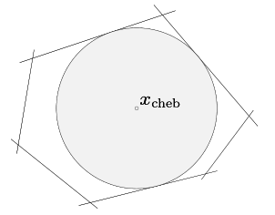

等价条件:
$$
\text{maximum } r \text{ , subject to } a_i^Tx_c+r||a_i||_2 \leq b_i, i=1,..., m
$$
**linear-fractional program**
$$
f_0(x)=\frac{c^Tx+d}{e^Tx+f}, \textbf{ dom }\rm f_0(x)=\{x|e^Tx+f>0\}
$$
 equivalent to the LP (variables $y$, $z$)

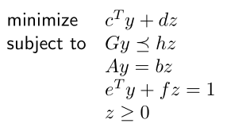

# Quadratic Program (QP) 二次优化问题

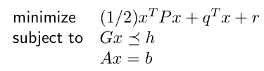

$P \in S_+^n$, so objective is convex quadratic.

**least-squares**: $\min ||Ax-b||_2^2$

analytical solution $x^⋆$ = $A^†b$ ($A^†$ is pseudo-inverse 伪逆)

**linear program with random cost**: 
$$
\text{minimize } \tilde{c}^Tx+\gamma x^T\sum x = \bf E \rm c^Tx + \gamma \bf var \rm (c^Tx)\\
\text{subject to } Gx \leq h, Ax=b
$$

- $c$ is random vector with mean $\tilde{c}$ and covariance $\sum$
- Hence, $c^Tx$ is random variable with mean $\tilde{c}^Tx$ and variance $x^T\sum x$
- \gamma controls the trade-off between expected cost and variance (risk)

**Quadratically constrained quadratic program (QCQP)**

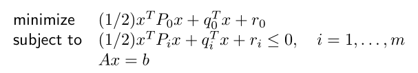

# Second-order cone programming 二阶锥规划 (SOCP)

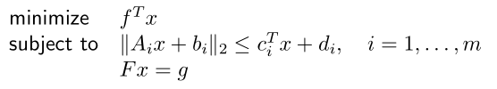 

$A_i \in \bf R \rm^{n_i \times n}, F \in \bf R^{p \times n}$

for $n_i$ = 0, reduces to an LP; if $c_i$ = 0, reduces to a QCQP

**Robust Linear Programming**

例如, 不等式形式的线性规划, the parameters in optimization problems are often uncertain

为简洁起见, 假设 c 和 b_i 是固定的, 并且知道 a_i 在给定的椭球中

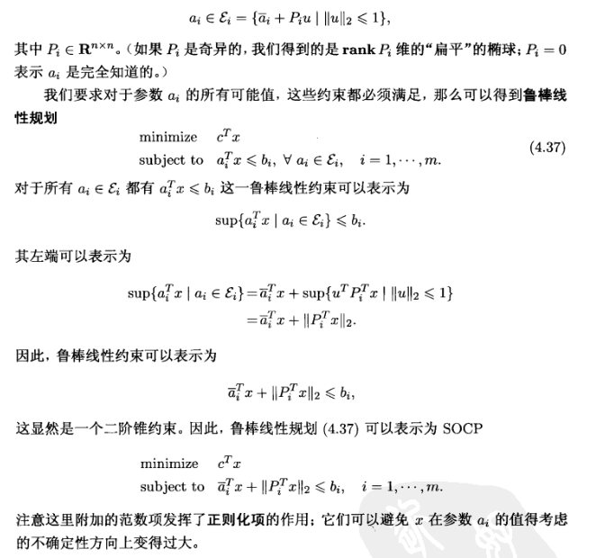

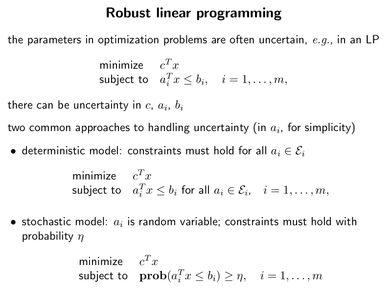

#  geometric programming
# generalized inequality constraints
# semidefinite programming
# vector optimization

