# 拉格朗日对偶函数

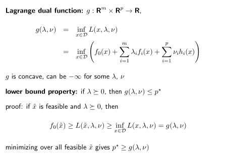

> g is concave, even the original problem is non-convex. 理由是任何 affine function 的 inf 都是concave 的, 而且 g(\lambda, \nu)可以看做是对 (\lambda, \nu) 的仿射变换. 这里给我的启示是: dual functions provide a parametrized lower bound on the optimal value of  the problem, 也就是说对偶函数给出了原本复杂的问题的最优值的一个下界

> $\lambda_if_i(x) \leq 0, \nu_ih_i(x) =0$

> maximizing the lower bound is a convex optimization problem. 
>
> but why \max lower bound: cuz It's better

### Norm Problem

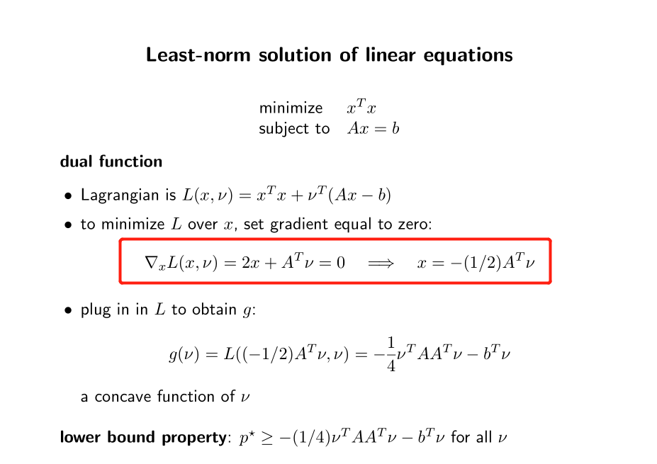

### Linear Problem

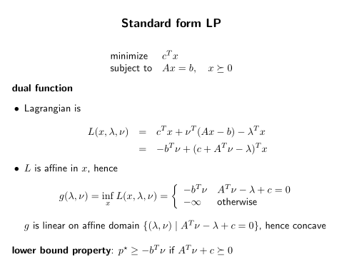

### Two-way partitioning (Non-convex)

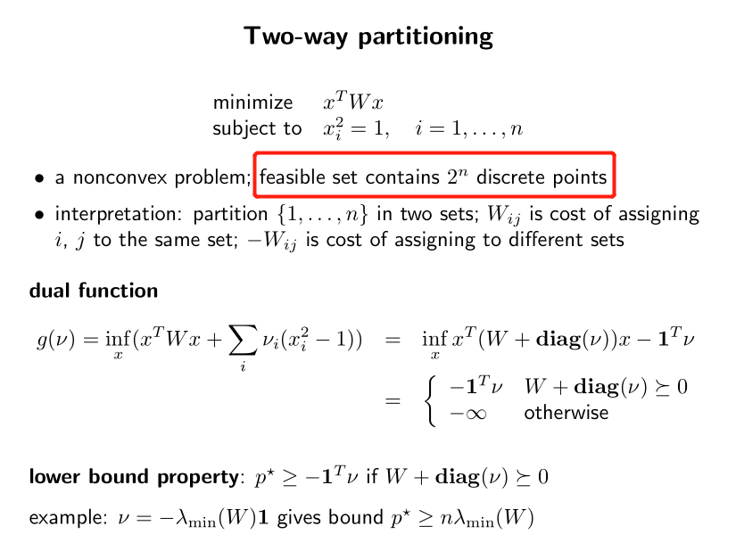

> $W+\text{diag}(\nu) \geq 0$ indicates that it is semi-definite

令对偶变量取值为 $\nu=-\lambda_{min}(W)\bf 1$,其中$\lambda_{min}(W)$代表矩阵W的最小特征值, 则 $W+\text{diag}(\nu) = W -\lambda_{min}(W)\bf I\geq 0$, 此时 $-\bf{1} \rm ^T \nu = n\lambda_{min}(W)$

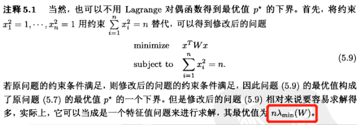

### Lagrange dual and conjugate function (共轭函数)**

共轭函数的定义: 
$$
f^*(y)=\sup_{x \in \textbf{dom } \rm f}(y^Tx-f(x))
$$
共轭函数与对偶函数的关系:

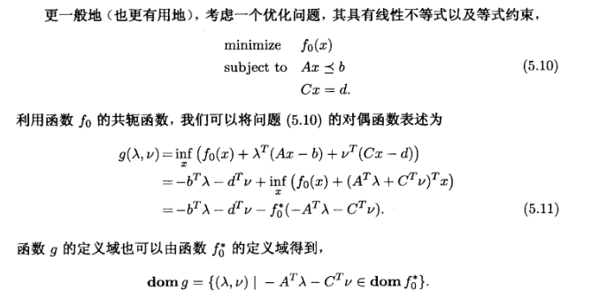

从共轭的角度看 Equality constrained norm minimization 等式约束条件下的范数极小化

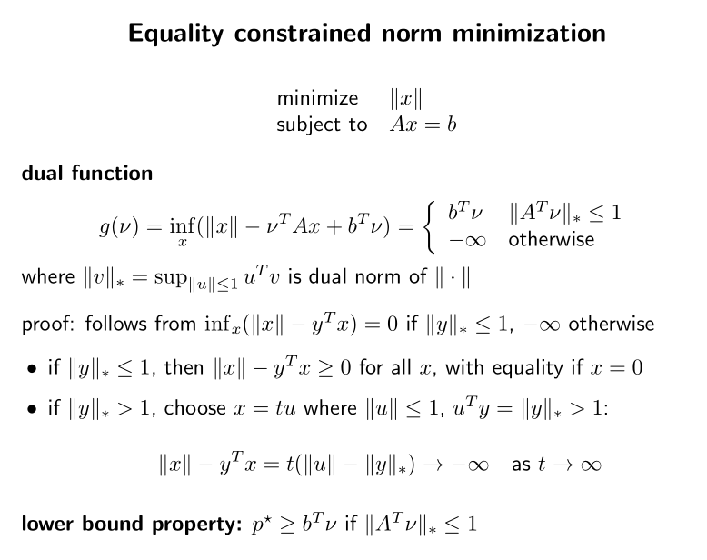

从共轭的角度看熵的最大化
$$
\text{minimize } f_0(x)=\sum_{i=1}^nx_i\log x_i\\
\begin{aligned}
\text{subject to  }  & Ax \leq b \\
& \bf 1 \rm^Tx=1
\end{aligned}
$$
根据共轭函数的定义: 
$$
f^*(y)=\sup_{x \in \textbf{dom } \rm f}(y^Tx-f(x))
$$
熵函数的共轭函数为:
$$
f_0^*(y)=\sum_{i=1}^n e^{y_i-1}
$$
熵函数的对偶函数可以表示为:

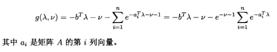

# 对偶问题

再复习一次拉格朗日对偶函数

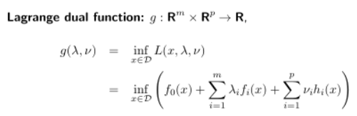

然后再看对偶问题

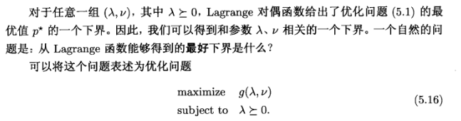

- finds best lower bound on p⋆ , obtained from Lagrange dual function

- **a convex optimization problem; optimal value denoted d⋆**

- λ, ν are dual feasible if λ >= 0, (λ,ν) ∈ dom g

- often simplified by making implicit constraint (λ,ν) ∈ dom g explicit, 例如:
  $$
  \text{minimize } c^Tx\\
  \begin{aligned}
  \text{subject to } &Ax=b\\
  &x \geq 0\\
  \end{aligned}
  $$
  make it explicit:
  $$
  \text{maximize } -b^T\nu\\
  \begin{aligned}
  \text{subject to } &A^T\nu + c \geq 0\\
  \end{aligned}
  $$
  其中 $-b^T\nu$ 可以在 Linear Problem 那个部分找到

# Weak/Strong Duality Gap

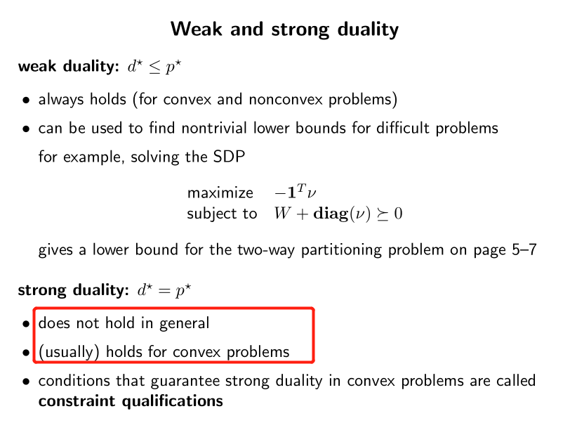

##### duality gap: 

$$
\text{duality gap } =d^*-p^*
$$

### 强对偶性与slater约束准则

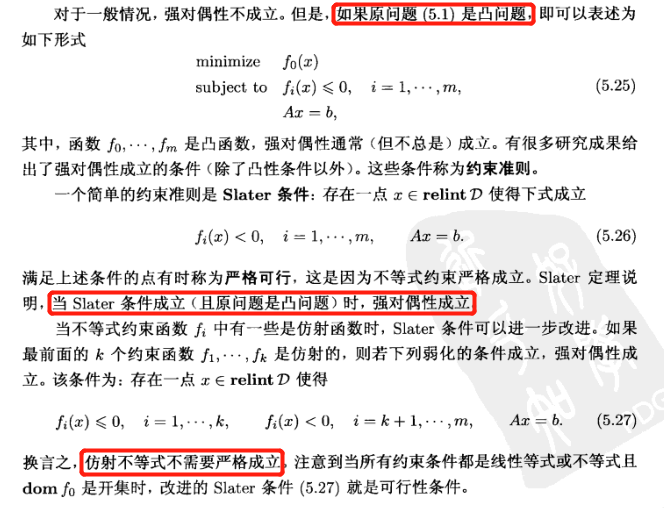

> Note: **relint 相对内点集合** 
>
> **仿射集（Affine set)**: 通过集合C中任意两个不同点的**直线**仍然在集合C内，则称集合C为仿射集。
>
> **仿射包 (affine hull)**: 包含集合C的最小仿射集。
>
> **内点**: 对于集合C中的某个点x，以x为中心做半径为r的球B（r>0，且足够小），若球B完全落在C的内部（即B是C的子集），则x为C的内点。
>
> **相对内点**: 集合C的仿射包A的内点y，如果y位于C中，则称y为集合c的**相对内点relint**.（另一种解读: 对于集合C中的某个点y，以y为中心做半径为r的球B（r>0，且足够小），若球B和A的交集完全落在C的内部（即B∩A是C的子集），则y为C的相对内点。）

对于线性规划问题（无论是标准形式还是不等式形式）只要原问题可行，强对偶性都成立。其实只有一种情况下强对偶性不成立：原问题与对偶问题均不可行。

举例：熵函数最大化

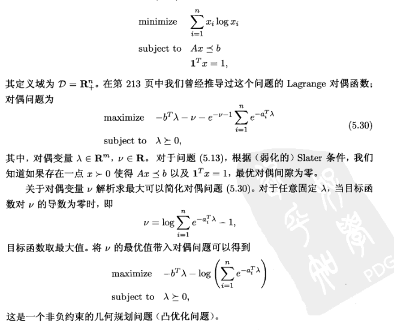

对于凸问题，强对偶性成立，但是对于非凸问题，强对偶性也有成立的时候。

> 再复习一次凸问题的定义: 
>
> 

教材（236/712）/讲义（5-14）的示例，实际上存在一个更一般的结论，**如果slater条件成立，对于具有二次目标函数和一个二次不等式约束的优化问题，强对偶性总是成立**

# 鞍点解释拉格朗日对偶

### 强弱对偶性的极大极小描述

假设没有等式约束条件 $\nu $, 拉格朗日函数表示为 $\inf_x L(x,\lambda)$

是关于 x 的函数（$f_i(x) \leq 0$ shit）

拉格朗日函数 $\inf_x L(x,\lambda)$ 给出了原本复杂的问题的最优值的一个下界

$d^*$: 拉格朗日函数 $\inf_x  L(x,\lambda)$ 的最好下界

原问题的最优值是 $p^*$ 表达式是怎么来的？如下图：

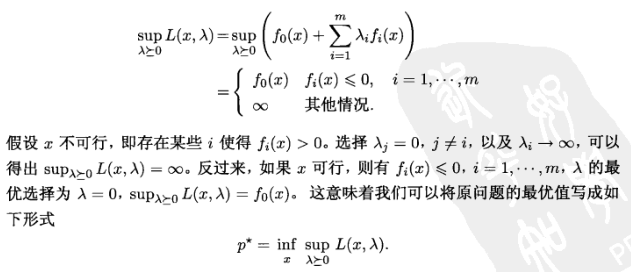

---

$$
\text{原问题的最优值表示为}\\
p^*=\inf_x \sup_{\lambda \geq 0}L(x,\lambda)\\
\text{根据对偶函数的定义，有}\\
d^*=\sup_{\lambda \geq 0} \inf_x L(x,\lambda)
$$

根据 $p^* \geq d^* $
$$
\inf_x \sup_{\lambda \geq 0}L(x,\lambda) \geq \sup_{\lambda \geq 0} \inf_x L(x,\lambda)
$$
若等式成立，称 L 满足鞍点性质

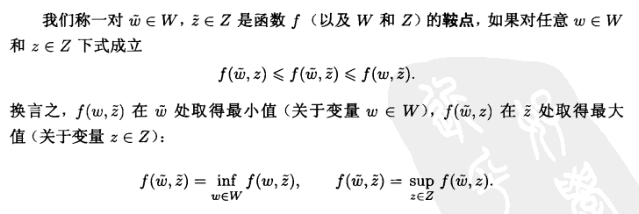

# KKT

