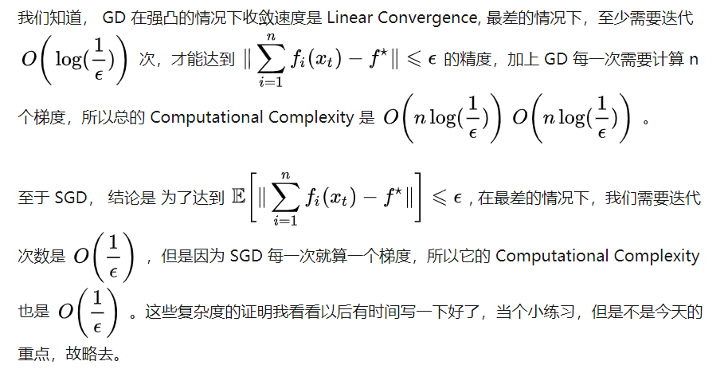

[TOC]

# 1. 从简单的开始 — 先建立一个更简单的模型，然后通过对几个数据点的训练进行测试

# 2. 确认您的损失 — 检查是否使用正确的损失，并检查初始损失

要保证该损失函数适合于任务:

- 对于多分类问题使用类别交叉熵损失
- 使用focal loss来解决类不平衡

要保证损失函数在以正确的尺度进行测量

- 如果神经网络中使用了不止一种类型的损失，那么请确保所有损失都按正确的顺序进行了缩放

**[划重点!!!!!!!!!!] **最初的损失也很重要。

- 如果模型一开始就随机猜测，检查初始损失是否接近预期损失。
- 在随机表现上寻找正确的损失。确保在初始化小参数时得到预期的损失。最好先单独检查数据的loss (将正则化强度设置为零)。
  - 例如，对于使用Softmax分类器的CIFAR-10，我们期望初始损失为2.302，因为我们期望每个类的随机概率为0.1(因为有10个类)，而Softmax损失是正确类的负对数概率，因此:-ln(0.1) = 2.302。
  - 对于二分类的例子，只需对每个类执行类似的计算。假设数据是20%的0和80%的1。预期的初始损失是- 0.2ln(0.5) - 0.8ln(0.5) = 0.693147。**如果你的初始损失比1大得多，这可能表明你的神经网络权重不平衡(即初始化很差)或者你的数据没有标准化。**

# 3. 检查中间输出和连接 — 使用梯度检查和可视化检查看图层是否正确连接，以及梯度是否如预期的那样更新

Faizan Shaikh描述了可视化神经网络的三种主要方法：

- **初步方法** - 打印出神经网络各层的形状或滤波器以及各层的参数。
- **基于激活的方法** - 在这些方法中，我们解码单个神经元或一组神经元的激活情况，以直观地了解它们在做什么 (ConX 和 Tensorboard: 可视化单个层的激活和连接)。
- **基于梯度的方法** - 这些方法倾向于在训练模型时操作由前向和后向传递形成的梯度。

# 4. 诊断参数 — 从SGD到学习率，确定正确的组合(或找出错误的)

## 4.1 Batch Size

> 这里介绍了 ICLR2017 文章：
>
> [《On Large-Batch Training for Deep Learning: Generalization Gap and Sharp Minima》](https://openreview.net/pdf?id=H1oyRlYgg) 

该工作探究了深度学习中一个普遍存在的问题——使用大的 batch-size 训练网络会导致网络的泛化性能下降（文中称之为 Generalization Gap）。文中给出了 Generalization Gap 现象的解释：大的batch-size 训练使得目标函数倾向于收敛到 sharp minima（类似于local minima），sharp minima 导致了网络的泛化性能下降，同时文中给出了直观的数据支持。而小的 batch-size 则倾向于收敛到一个 flat minima，这个现象支持了大家普遍认为的一个观点：小的 batch-size 存在固有噪声，这些噪声影响了梯度的变化。

小的batch-size将导致学习过程以训练过程中的噪声为代价快速收敛，但是可能导致优化困难。 

当然，large batch size 的问题目前可以用 batch normalization 解决。

- BN 减轻了对参数初始化的依赖，利于调参。
- 训练更快，可以使用更高的学习率。
- BN 一定程度上增加了泛化能力，dropout等技术可以去掉。

## 4.2 Learning Rate

> 这里介绍了常见的学习率规划方法。 
>
> **学习率规划器也被称为学习率的模拟退火，自适应学习率**。
>
> 参考资料: [Github Blog Here](https://arrayzoneyour.github.io/2018/02/17/%E5%9C%A8%E6%B7%B1%E5%BA%A6%E5%AD%A6%E4%B9%A0%E6%A8%A1%E5%9E%8B%E4%B8%AD%E4%BD%BF%E7%94%A8%E5%AD%A6%E4%B9%A0%E7%8E%87%E8%B0%83%E5%BA%A6%E5%99%A8/)

### 4.2.1 连续衰减的学习率规划器

Keras内置的学习率规划器就是随训练批次连续衰减的。 

```
LearningRate = LearningRate / (1 + decay * epoch)
默认情况下，decay的值为0，所以学习率在训练过程中为常数。
```

在设置衰减常数时，下面的公式可以作为参考，通常可以达到不错的效果：

```
Decay = LearningRate / Epochs
Decay = 0.1 / 100
Decay = 0.001
```

### 4.2.2 阶梯式衰减的学习率规划器

```python
# learning rate schedule
def step_decay(epoch):
    initial_lrate = 0.1
    drop = 0.5
    epochs_drop = 10.0
    lrate = initial_lrate * math.pow(drop, math.floor((1+epoch)/epochs_drop))
    return lrate

......

from keras.callbacks import LearningRateScheduler
lrate = LearningRateScheduler(step_decay)
callbacks_list = [lrate]
model.fit(X, Y,                                      # Fit the model
          validation_split=0.33, 
          epochs=50, 
          batch_size=28, 
          callbacks=callbacks_list, 
          verbose=2)
```

### 4.2.3 总结: 学习率计划器常用技巧

- **提高初始学习率**。因为学习率一般会随着训练批次的增加而降低，所以不妨让学习率从一个较高的水平开始下降。较大的学习率可以使模型在初始训练时权重有更大的变化，有助于后续低学习率调优时收敛至更优的权重范围。
- **使用大的动量系数**。使用大的动量系数可以保证在你的学习率衰减得比较小时，优化算法还可以使模型权重在正确的方向上以较快的速度收敛。
- **尝试不同的学习率计划器**。因为现在还没有理论明确地指出什么情况下应该使用什么样的学习率规划器，所以你需要尝试各种不同的配置来寻找最适合你当前问题的计划器配置。你可以按照指数规律划分学习率规划器的参数，也可以根据模型在训练集/测试集上响应的结果自适应地调整学习率规划器参数。

### 4.2.4 PyTorch LR Scheduler

```python
import torch.optim as optim
from troch.optim import lr_scheduler

optimizer = optim.Adam(mode.parameters(), lr=0.001)
## 这里的step_size表示epoch，每隔多少个epoch衰减一次
## gamma表示衰减率
scheduler = lr_scheduler.StepLR(optimizer, step_size, gamma=0.1)

......

scheduler.step()
```

## 4.3 梯度裁剪 ( 处理BP时梯度消失/爆炸 )

### 4.3.1 PyTorch 梯度裁剪实现

nn.utils.clip_grad_norm(parameters, max_norm, norm_type=2)

这个函数是根据参数的范数来衡量的

Parameters:

- **parameters** (PyTorch Variable) – 一个基于变量的迭代器，会进行归一化（原文：an iterable of Variables that will have gradients normalized）
- **max_norm** ([*float*](https://docs.python.org/2/library/functions.html#float) *or* [*int*](https://docs.python.org/2/library/functions.html#int)) – 梯度的最大范数（原文：max norm of the gradients）
- **norm_type**([*float*](https://docs.python.org/2/library/functions.html#float) *or* [*int*](https://docs.python.org/2/library/functions.html#int)) – 规定范数的类型，默认为 L2（原文：type of the used p-norm. Can be' inf' for infinity norm）

Returns:

- 参数的总体范数（作为单个向量来看）（原文：Total norm of the parameters (viewed as a single vector).）

```python
optimizer.zero_grad()        
loss, hidden = model(data, hidden, targets)
loss.backward()
 
torch.nn.utils.clip_grad_norm(model.parameters(), args.clip)
optimizer.step()
```

## 4.4 Batch Normalization

> 以下来自: [Dishank Bansal's Blog](https://towardsdatascience.com/pitfalls-of-batch-norm-in-tensorflow-and-sanity-checks-for-training-networks-e86c207548c8)

### 4.4.1 定义

#### 4.4.1.1 Training


#### 4.4.1.2 Inference


### 4.4.2 TensorFlow的BN常见错误

#### 4.4.2.1  Moving mean and variance not updating

- ``tf.nn.batch_normalization()`` - Never use this for training, it just compute the y = gamma * x^hat + beta, where x^hat = (x-mean) / std_dev. It doesn't account for keeping moving mean and variance. 

- ``tf.layers.batch_normalization()`` - This function can be used for your model. Note: Always add batch norm dependency when using this, either on optimizer op or any other op which you sure that will execute when optimizer op is run.

  ```python
  update_ops = tf.get_collection(tf.GraphKeys.UPDATE_OPS)
  with tf.control_dependencies(update_ops):
      self.solver = tf.train.AdamOptimizer(learning_rate=1e-04) .minimize(self.loss)
  ```

  Here ``tf.GraphKeys.UPDATE_OPS`` is the collections which have moving mean and variance op.

- ``tf.contrib.layers.batch_norm()`` - This function is in contrib module of TensorFlow. This function gives two ways to add dependencies as follows:
  - It has 'update' parameter, set update=None while calling the function and dependency will be added inside the function itself and you don't have to anything else. Note: This is believed to be slow in comparison to the next method.
  - Let the 'update' parameter have it's default value which is ``tf.GraphKeys.UPDATE_OPS``. Now here also you have to manually add dependency as above with ``tf.layers.batch_normalization()``.

#### 4.4.2.2 Different usage at train and test time

```python
def Bn(x, is_train):
        return tf.contrib.layers.batch_norm(x, 
                                            decay= 0.99,
                                            is_training=is_train,
                                            center= True, 
                                            scale=True, 
                                            reuse= False)

train_phase = tf.placeholder(tf.bool, name="is_training")
data = tf.placeholder(tf.float32, shape=[None,240,240,3], name="Image")                                         
bn_layer = Bn(data, train_phase)

loss = some_loss_op()

solver = tf.train.AdamOptimizer().minimize(loss)

# Training iteration
sess.run(solver, {data: input_data, train_phase:True})

#Validation iteration
sess.run(loss, {data: input_data, train_phase:False})
```

#### 4.4.2.3  Sharing Batch Norm parameters

主要说的是GAN的训练: **sharing batch norm parameters is okay until input distributions to both shared batch norm layers are same**, if this is not the case try to use `reuse=False` in above mentioned batch norm functions, which will allow you to have independent batch norm parameters for both of your networks in which you wanted to share weights.  

> Let’s say we are training a GAN, it will have two discriminator instance with share parameters, when the training starts, distributions of fake and real images are different. Now here we are updating the moving mean and variance with two different distributions, one is of fake images and the other real one. But as the training continues and generator learns the distribution of real data, then distribution of both fake and real data eventually becomes approximately same. Then we are updating the mean and variance with same distribution, so our population mean and variance should be estimated statistics of real data after complete training. 

## 4.5 随机梯度下降 (SGD)

> 以下来自 [知乎专栏: 为什么我们更宠爱“随机”梯度下降](https://zhuanlan.zhihu.com/p/28060786)

### 4.5.1 SGD 相对于 GD 的优势

- **Part I: 直觉上 (Intuitive Motivation)，相对于非随机算法，SGD 能更有效的利用信息，特别是信息比较冗余的时候。**信息冗余时，许多样本计算得到的梯度都是相似甚至相同的，没有必要把他们全部算出来再取平均。

- **Part II: 实验上 (Practical Motivation)，相对于非随机算法， SGD 在前期迭代效果卓越。**

- **Part III: 理论上  (Theoretical Motivation)，如果样本数量大，那么 SGD的Computational Complexity 依然有优势。**

  

  

## 4.6 正则化

正则化对于构建可泛化模型至关重要，因为它增加了模型复杂度或极端参数值的代价。它显著降低了模型的方差，而没有显著增加其偏差。

**通常情况下，损失函数是数据损失和正则化损失的总和(例如L2对权重的惩罚)。需要注意的一个危险是正则化损失可能会超过数据损失，**在这种情况下，梯度将主要来自正则化项(它通常有一个简单得多的梯度表达式)。这可能会掩盖数据损失的梯度的不正确实现。为了检查这个问题，应该关闭正则化并独立检查数据损失的梯度。 

## 4.7 Dropout

如果同时使用dropout和批处理规范化(batch norm)，那么要注意这些操作的顺序，**先dropout后BN**。

- 来自 Stackoverflow 的用户 `MiloMinderBinder`：Dropout是为了完全阻断某些神经元的信息，以确保神经元不相互适应。因此，batch-norm必须在dropout之后进行，否则你将通过标准化统计之后的数据传递信息。

- 来自 arXiv：*Understanding the Disharmony between Dropout and Batch Normalization by Variance Shift* — 从理论上讲，我们发现，当我们将网络状态从训练状态转移到测试状态时，Dropout会改变特定神经单元的方差。但是BN在测试阶段会保持其统计方差，这是在整个学习过程中积累的。当在BN之前的使用Dropout时，该方差的不一致性(我们将此方案命名为“方差漂移”)导致不稳定的推断数值行为，最终导致更多的错误预测。

# 5. 跟踪您的工作 — 作为基线，跟踪你的实验过程和关键的建模组件，一句话就是写好log文件


