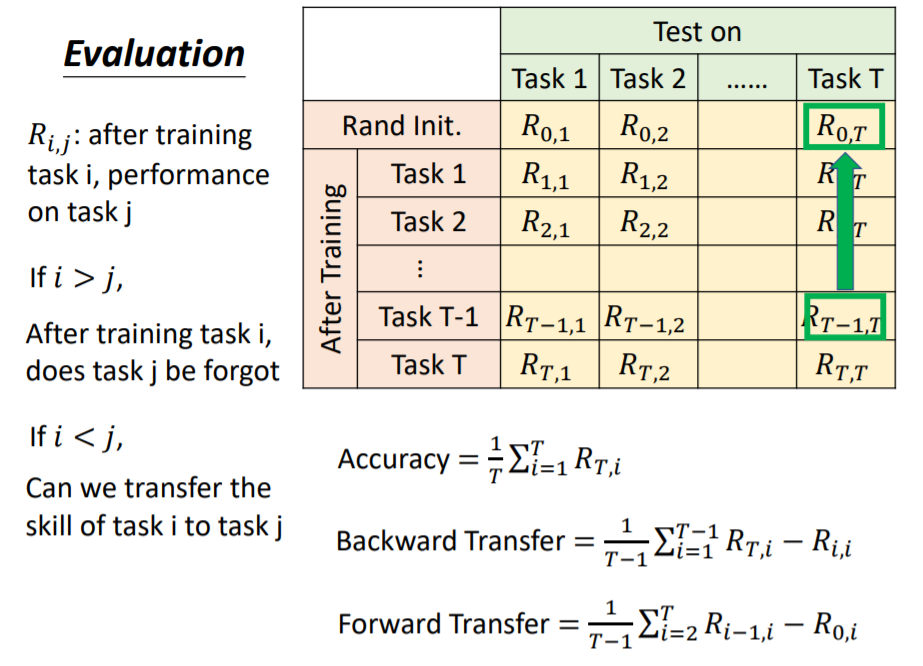
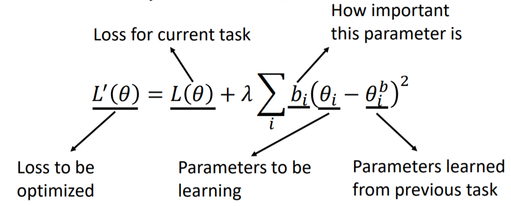
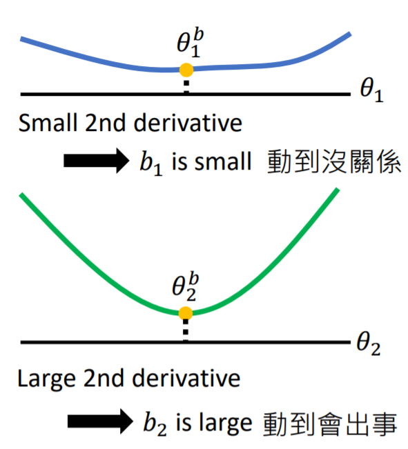
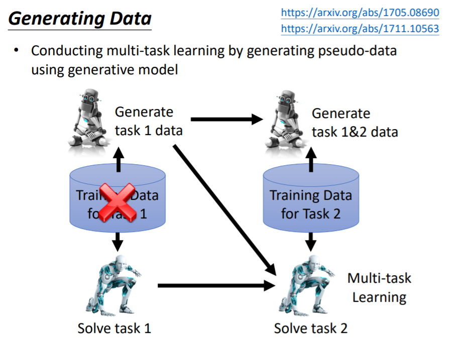
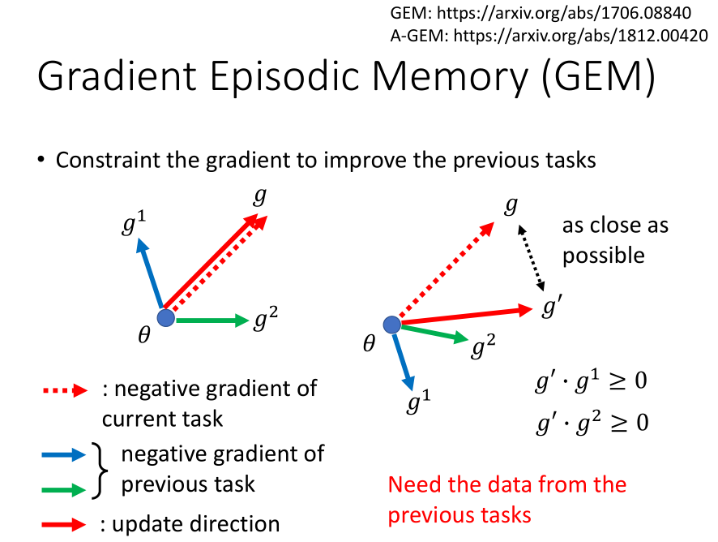
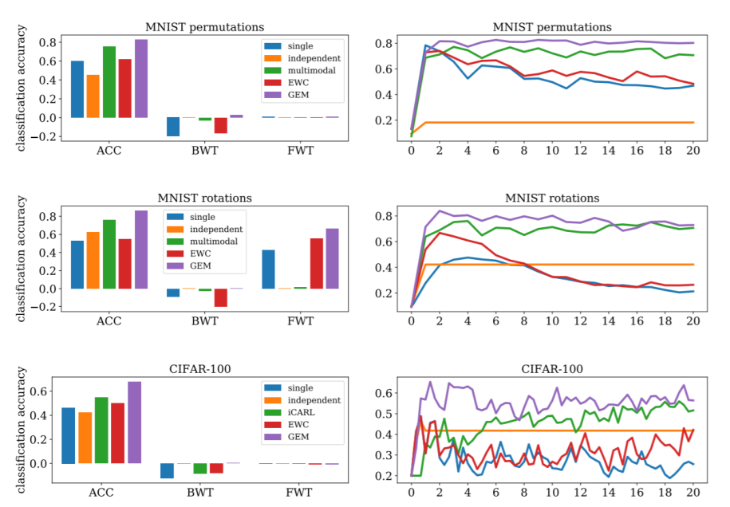
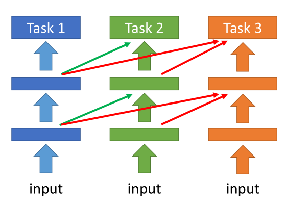

[TOC]

# Overview

1. multi-task learning 是 lifelong learning 的 upper bound, 用 multi-task learning 的方法就可以解决模型遗忘的问题
2. 终身学习被李宏毅总结为三大方向：knowledge retention, knowledge transfer, model expansion

# Lifelong Learning Performance Evaluation

# 1. Knowledge Retention: to memorize previous tasks

## (1) Elastic Weight Consolidation (EWC) 

场景：终身学习（学了一个任务之后又要在当前网络学下一个任务）

我们可以肯定的是对于特定的任务，网络中有些参数重要，有些不重要（这也是网络压缩的动机之一）。

EWC的方法是：Each parameter $\theta_i^b$ has a “guard”  $b_i$, 告诉我们这个参数有多重要，类似于网络压缩算法中的 saliency score。

EWC损失函数中，相当于加了一项L2范数。

> If $𝑏_𝑖 = 0$, there is no constraint on $𝜃_𝑖$
>
> If $𝑏_𝑖 = \infty$, $𝜃_𝑖$ would always be equal to $𝜃_𝑖^𝑏$

研究的方向是如何设计 $b_i$ 的值。

### 一种简单的方法：二阶微分

### 其它方法 (todo)

1. Synaptic Intelligence (SI), ICML 2017

   > https://arxiv.org/abs/1703.04200

2. Memory Aware Synapses (MAS), ECCV 2018

   > Special part: Do not need labelled data
   > https://arxiv.org/abs/1711.09601

## (2) Generating Data

### Motivation

如果一个模型做不到 lifelong learning（也就是说它不能记住过去加载过的资料），可不可以训练一个模型（train a generator），使其能生成（generate）过去的资料，而不是需要重新加载过去的资料（如果重新加载 imageNet 这种代价就太大了）

### Overview

### Drawback

how to train a generator 还需研究，现在在 mnist 上效果还可以，这个方向的发展取决于GAN的发展。

## (3) Adding New Classes (项目相关) (todo)

### Learning without Forgetting (ECCV 2016)

### iCaRL: Incremental Classifier and Representation Learning (CVPR 2017)

# 2. Knowledge Transfer: different from transfer learning

迁移学习只考虑当前任务的表现，终身学习还需要保证以前任务的表现。

## Example: Gradient Episodic Memory (GEM)

在GEM算法中，需要保留部分过去的资料（sub dataset for previous tasks）

缺点：大数据集还是不行

# 3. Model Expansion

## Progressive Neural Networks (2016)

每一个任务都有自己的网络，previous task的hidden layer output也是current task的input

## Expert Gate

训练一个task detector，判断新任务与 previous tasks 哪个最像，然后把那个任务的 model 当做当前任务的 initialization。

## Net2Net

前两种方法的缺点：不同的任务还是不同的模型。

# Future Work: Curriculum Learning, 任务训练的顺序会影响模型的表现

CVPR 2018 Best Paper —— 《taskonomy》