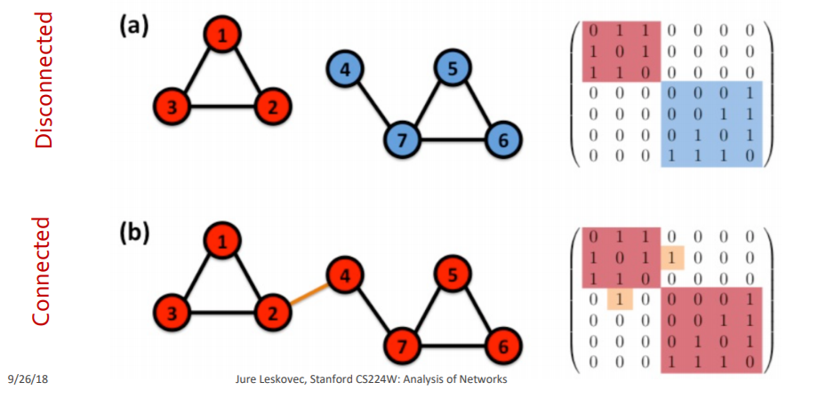

[TOC]

# 绪论

网络分析涉及的问题：

-  **Node classification**:  Predict the type/color of a given node 
-  **Link prediction**:  Predict whether two nodes are linked 
-  **Community detection**:  Identify densely linked clusters of nodes 
-  **Network similarity**:  Measure similarity of two nodes/networks 

课程设置

| Course Description                           | Lectures |
| -------------------------------------------- | -------- |
| Graph concepts, models and measurements      | (1-3)    |
| Network Construction and Inference           | (4)      |
| Link Analysis: PageRank and SimRank          | (5)      |
| Network Motifs: Structural roles in Networks | (6)      |
| Community Detection                          | (7, 8)   |
| Link Prediction                              | (9)      |
| Node Representation Learning: Node2Vec       | (10)     |
| Information Cascades                         | (11, 12) |
| Influence & Outbreak Detection               | (13, 14) |
| Network Robustness                           | (15)     |
| Network Evolution                            | (16)     |
| Node Centrality and Anomaly Detection        | (17)     |
| Knowledge Graphs and Metapaths               | (18)     |
| Message passing and Node classification      | (19)     |
| Graph Convolutional Neural Networks          | (20)     |

# 网络的基础知识

网络三要素

- Objects: nodes, vertices
- Interactions: links, edges
- System: network, graph 

图与网络

- 图是数学表示（Language: Network, node, link）
- 网络是实际系统的抽象表示（Language: Graph, vertex, edge）。

邻接矩阵

- A_{ij}=1 说明 there is a link from node i to node j 
- 无向图的邻接矩阵是对称矩阵

边的性质 Edge Attributes 

- Weight (e.g. frequency of communication)
- Ranking (best friend, second best friend…)
- Type (friend, relative, co-worker)
- Sign: Friend vs. Foe, Trust vs. Distrust
- Properties depending on the structure of the rest of the graph: number of common friends 

多重图 Multigraph: 两点之间有多条边

无向图的连通性: 任意两点之间有路径

Bridge edge: If we erase the edge, the graph becomes disconnected

Articulation node: If we erase the node, the graph becomes disconnected

巨连通集团 Giant Component: Largest Component

无向图, 非连通, 邻接矩阵可以分为多个对角阵: The adjacency matrix of a network with several components can be written in a block- diagonal form, so that nonzero elements are confined to squares, with all other elements being zero 

