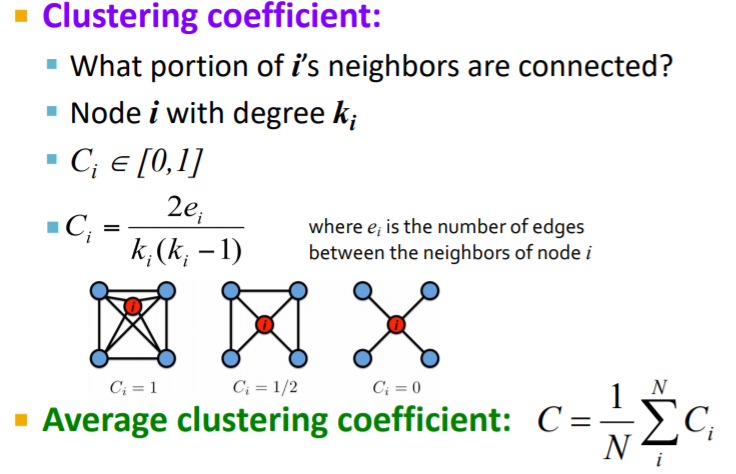
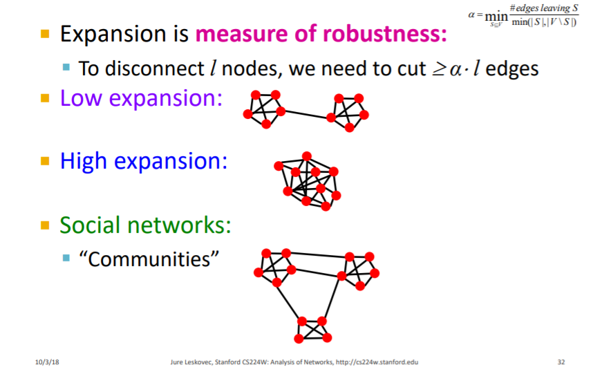
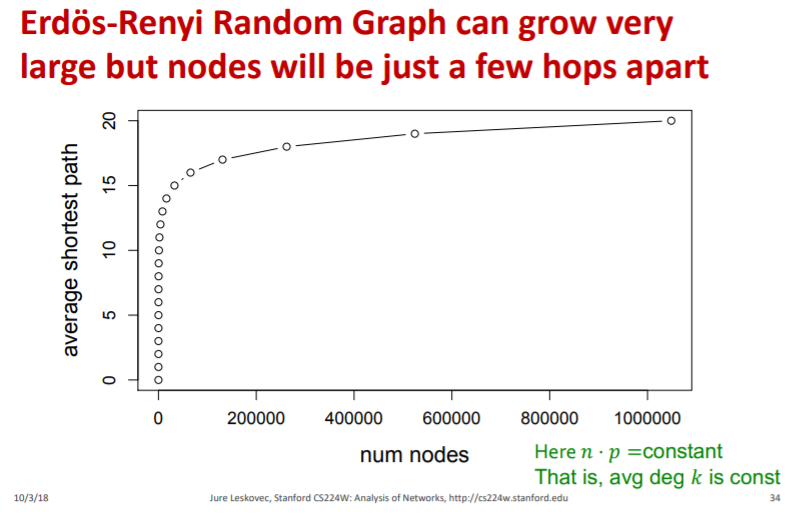
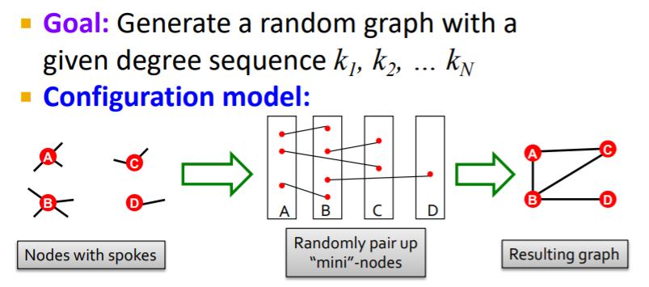

[TOC]

# 1. Network Properties

## 1.1 Degree distribution

## 1.2 Path Length

### Distance

网络中两个节点的距离: Distance (shortest path, geodesic) between a pair of nodes is defined as the number of edges along the **shortest path** connecting the nodes.

### Diameter

网络直径 **Diameter: The maximum (shortest path) distance** between any pair of nodes in a graph.

## 1.3 Clustering Coefficient (集聚系数)

对于第一个示例: C_i = (2 * 6) / (3 * 4) = 1

在图论中，集聚系数（也称群聚系数、集群系数）是用来描述一个图中的顶点之间结集成团的程度的系数。具体来说，是一个点的邻接点之间相互连接的程度。例如生活社交网络中，你的朋友之间相互认识的程度。有证据表明，在各类反映真实世界的网络结构，特别是社交网络结构中，各个结点之间倾向于形成密度相对较高的网群。也就是说，相对于在两个节点之间随机连接而得到的网络，真实世界网络的集聚系数更高。

## 1.4 Connected Components

### BFS to find connected components: 

- Start from random node and perform Breadth First Search (BFS)
- Label the nodes BFS visited
- If all nodes are visited, the network is connected
- Otherwise find an unvisited node and repeat BFS 

# 2. Random Graph Model

## 2.1 ER

$$
G_{n,p} \text{: undirected graph on n nodes and each edge (u,v) appears i.i.d. with probability p }
$$

 ### Binomial Degree Distribution
$$
P(k) = \bigl(
    \begin{matrix}
		n-1\\k
	\end{matrix}
\bigr)p^k(1-p)^{n-1-k}\\
\text{Mean: }\bar{k} = p(n-1)\\
\text{Variance: }p(1-p)(n-1)\\
$$

### Clustering Coefficient

$$
\text{Since }C_i = \frac{2e_i}{k_i(k_i-1)}, \\
\text{meanwhile }E[e_i] = p\frac{k_i(k_i-1)}{2}, \\
\text{Thus, }E[C]=p=\frac{\bar{k}}{n-1}\approx \frac{\bar{k}}{n}
$$

### Expansion: measure of rebustness \alpha

$$
\alpha = \min_{S \subseteq V} \frac{\text{# edges leaving S}}{\min(|S|, |V-S|)}
$$

### Path Length

- In a graph on n nodes with expansion α for all pairs of nodes there is a path of length O((log n)/α). 
- Random graphs have "good" expansion so it takes a logarithmic number of steps for BFS to visit all nodes.  For log n > np > c, diam(G_{n,p}) = O(log n/ log (np)).

### Average Distance (Average Shortest Path)

### Evolution of a Random Graph (as p changes)

看了Kaiming He的ReWANN，还得到了以下关于ER图的性质:

- 若，则G(n, p)中的一个图几乎必有孤立节点，因而它是不连通的。
- 若 ，则G(n, p)中的一个图几乎一定是连通的。

### ER图与现实网络的比较 (Problems with the random networks model)

- Degree distribution differs from that of real networks
- Giant component in most real network does NOT emerge through a phase transition
- No local structure – clustering coefficient is too low 

### 如何配置一个随机图(非ER)

## 2.1 小世界网络 (The Watts Strogatz Model)

