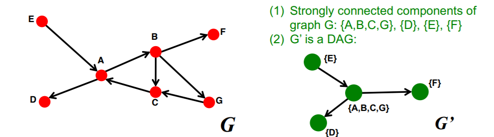
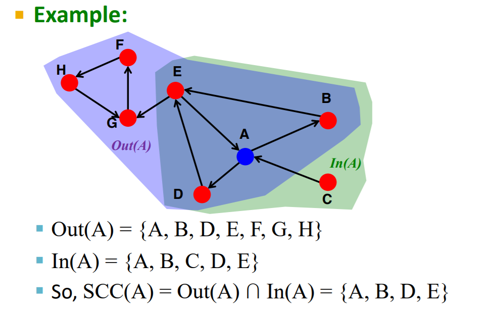
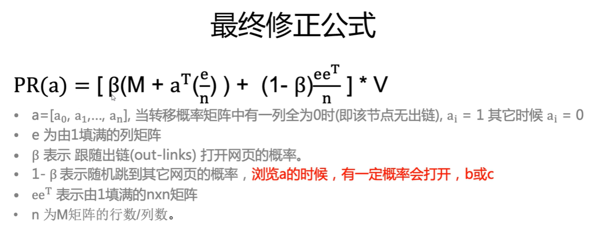
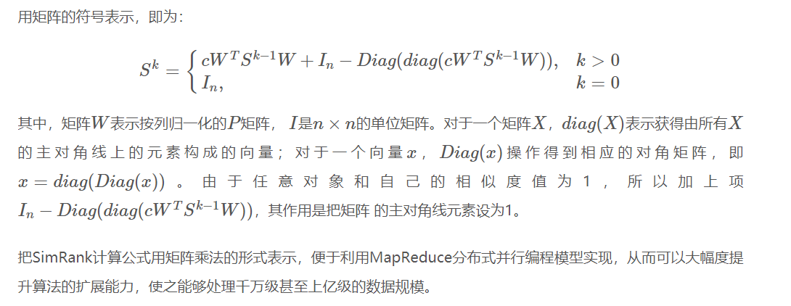

[TOC]

# 1. SCC strongly connected components

- Every pair of nodes in SCC S can reach each other;

- There is no larger set containing S with this property 

SCC与DAG的关系:

SCC containing v := Out(v) ∩ In(v)  

# 2.  Link Analysis  

## 2.1 PageRank

优点: 

Links as Votes; 

离线计算PageRank值而非查找时计算，提升了查询的效率

缺点: 

新生的网络rank增长慢, 时间久的网站rank值会越来越大; 

非查询相关的特性, 查询结果偏离搜索内容;

僵尸网站可能人为刷rank值

## 2.2 Random Walk (随机游走算法), 重启随机游走算法

随机游走算法的基本思想是，从一个或一系列顶点开始遍历一张图。在任意一个顶点，遍历者将以概率1-a游走到这个顶点的邻居顶点，以概率a随机跳跃到图中的任何一个顶点，称a为跳转发生概率，每次游走后得出一个概率分布，该概率分布刻画了图中每一个顶点被访问到的概率。用这个概率分布作为下一次游走的输入并反复迭代这一过程。当满足一定前提条件时，这个概率分布会趋于收敛。收敛后，即可以得到一个平稳的概率分布。随机游走模型广泛应用于数据挖掘和互联网领域，PageRank算法可以看作是随机游走模型的一个实例。 

重启随机游走算法是在随机游走算法的基础的改进。从图中的某一个节点出发，每一步面临两个选择，随机选择相邻节点，或者返回开始节点。算法包含一个参数a为重启概率，1-a表示移动到相邻节点的概率，经过迭代到达平稳，平稳后得到的概率分布可被看作是受开始节点影响的分布。重启随机游走可以捕捉两个节点之间多方面的关系，捕捉图的整体结构信息。 

## 2.3 SimRank

许多应用领域都需要度量对象之间的相似性。目前主要有两大类相似性度量方法：(1) 基于内容(content-based) 的特定领域 (domain-specific) 度量方法，如匹配文本相似度，计算项集合的重叠区域等；(2) 基于链接（对象间的关系）的方法，如PageRank、SimRank和PageSim等。**最近的研究表明，第二类方法度量出的对象间相似性更加符合人的直觉判断**。

SimRank算法基于一个简单和直观的图论模型，它把对象和对象之间的关系建模为一个有向图G = (V, E)，其中V是有向图的节点集合，代表应用领域中的所有对象；E是有向图的边的集合，表示对象间的关系。对于图中的一个节点a，与其所有入边关联的邻节点集合(in-neighbors)记为I(a)，同时，其出边对应的邻节点集合(out-neighbors)集合记为O(a)。用s(a,b)表示对象a和对象b之间的相似性，其计算公式:
$$
s(a,b) =
\begin{cases}
1, & a=b \\
\frac{c}{|I(a)||I(b)|} \sum_i^{|I(a)|} \sum_j^{|I(b)|} s\left( I_i(a),I_j(b) \right), & a \neq b \wedge I(a),I(b) \neq \emptyset\\
0, & \text{otherwise}
\end{cases}
$$
从该计算公式可以看出，个体a, b的相似度取决于所有与a, b相连节点的相似度。式中c是一个常量衰减因子。 

上述公式可以用矩阵的形式表示出来。假设S表示有向图G的SimRank分数矩阵，其中s(i,j)表示对象i和j之间的相似性分数； P表示G的连接矩阵，其中P(i,j)表示从顶点ii到顶点jj的边数，则:
$$
\begin{aligned}
s^{k+1}(a,b) &= \frac{c}{|I(a)||I(b)|} \sum_i^n \sum_j^n p_{i,a} \cdot s^{k}(a,b) \cdot p_{j,b} \\
&= c \cdot \sum_i^n \sum_j^n \left( \frac{p_{i,a}}{\sum_i^n p_{i,a}} \right) \cdot s^{k}(a,b) \cdot \left( \frac{p_{j,b}}{\sum_j^n p_{j,b}} \right)
\end{aligned}
$$

