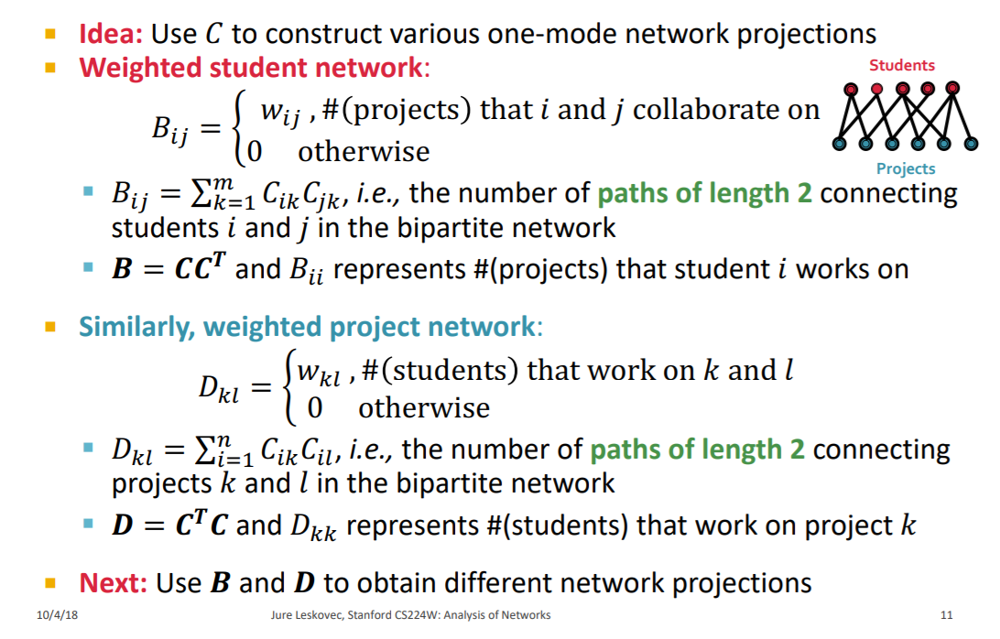
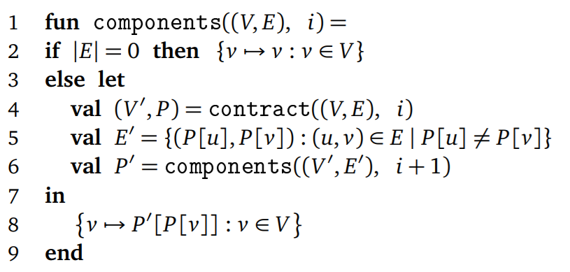

[TOC]

Keynote: How to construct and infer networks from raw data? 

# 1. Multimode Network Transformations

## 1.1 K-partite and bipartite graphs

Multi-partite networks:  objects of the multi types

## 1.2 One-mode network projections/folding

> Consider students 3, 4, and 5 connected in a triangle: Triangle can be a result of: 
>
> Scenario #1: Each pair of students work on a different project § Scenario 
>
> Scenario #2: Three students work on the same project
>
> **One-mode network projections discard some information** —— Cannot distinguish between #1 and #2 just by looking at the projection 

Let C be incidence matrix of student-project net, **C_{i, k} = 1 if student i works on project k**

C is an n × m; binary non-symmetric matrix: n is #(students), m is #(projects) 

## 1.3 Graph Contractions

Main Idea: Use graph contraction to eliminate cliques (集团, 完全子图, 图上两两相邻的点集)

Computational complexity of many algorithms depends on the size and number of large cliques.

应用: 简化复杂网络, 降低复杂度, 这样的话算法就可以在有“超节点”的网络上完美运行

应用: 可用于计算图的连通成分有几个(递归算法)

是一种可并行的随机算法.

# 2. K-Nearest Neighbor Graph Construction

## 2.1 定义

Edges from each v ∈ V to its K most similar objects in V under a given similarity measure (Cosine similarity for text; L2-norm distance of CNN-derived features for images)

K-NNGs allow us to use network methods on datasets with no explicit graph structure.

K-NNGs 可以用来做数据可视化, 用similarity metric去反映高维数据样本间的关系。

## 2.2 用NN-Descent算法构建一个K近邻图

NN-Descent [Dong et al., WWW 2011] —— Efficient algorithm to approximate K-NNG construction with arbitrary similarity measure.

## 2.3 补充两种相似度度量: EMD,  Jaccard

> https://www.zhihu.com/question/22521107

推土机距离英文翻译为Earth Mover's Distance（EMD），Peleg等最早提出EMD， Rubner等提出将EMD应用于与图像识别中，自此**EMD被应用于衡量两个概率分布之间的差异**。文献[2]证明了EMD满足相似度度量函数的4个条件（非负性，自身距离为0，对称性和三角不等性）。 

Earth Mover's Distance被译为推土机距离或者地球移动距离,顾名思义，其思想来源于一个生活问题：假设有若干数量的土堆，每个土堆的大小不一且分布的位置不一样。同时存在若干数量的土坑，每个土坑的大小不一且位置不一样。对于每个土堆-土坑对的运输成本是给定的（以距离表示）。任务是把土堆搬动并填到土坑里，如何规划运输方案，使运输成本最低。

于是EMD距离定义为:

在计算推土机距离之前需要对连续分布进行离散化。

两个特征点的匹配问题，首先得确定这两个特征点究竟是分布的样本点还是一个分布。至于是否匹配，那就得看与你设置的阈值的大小比较情况。 

>杰卡德距离: [百度百科](https://baike.baidu.com/item/%E6%9D%B0%E5%8D%A1%E5%BE%B7%E8%B7%9D%E7%A6%BB/15416212?noadapt=1#:~:targetText=Jaccard%E7%9B%B8%E4%BC%BC%E6%8C%87%E6%95%B0%E7%94%A8%E6%9D%A5,%E5%87%8F%E5%8E%BBJaccard%E7%9B%B8%E4%BC%BC%E7%B3%BB%E6%95%B0%E3%80%82)

杰卡德距离(Jaccard Distance) 是用来衡量两个集合差异性的一种指标，它是杰卡德相似系数的补集，被定义为1减去Jaccard相似系数。而杰卡德相似系数(Jaccard similarity coefficient)，也称杰卡德指数(Jaccard Index)，是用来衡量两个集合相似度的一种指标。

# 3. Network Deconvolution (How to separate direct dependencies from indirect ones?)

**动机**: Recognizing direct relationships between variables connected in a network is a pervasive problem in biological, social and information sciences as correlation-based networks contain numerous indirect relationships.  

Observed Network & True Network

$$
\begin{equation}
\begin{aligned}
G_{obs} &= G_{dir} + G_{dir}^2 + G_{dir}^3 + G_{dir}^4 \\
        &= G_{dir}(I-G_{dir})^{-1}
\end{aligned}
\end{equation}\\
\text{Thus, }G_{dir}=G_{obs}(I+G_{obs})^{-1}\\
\text{Then use closed-form expression for } G_{obs} \text{ to
recover true direct network } G_{dir}
$$
G 统一代表邻接矩阵

为了简化计算(不求逆矩阵), 需要特征值分解:

