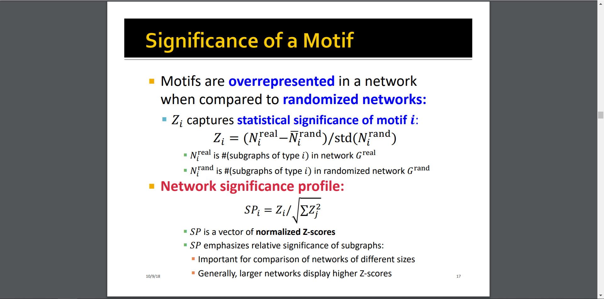
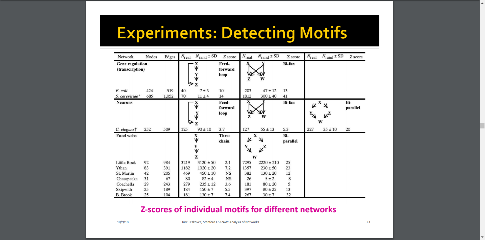
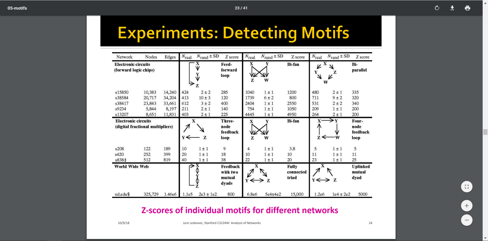
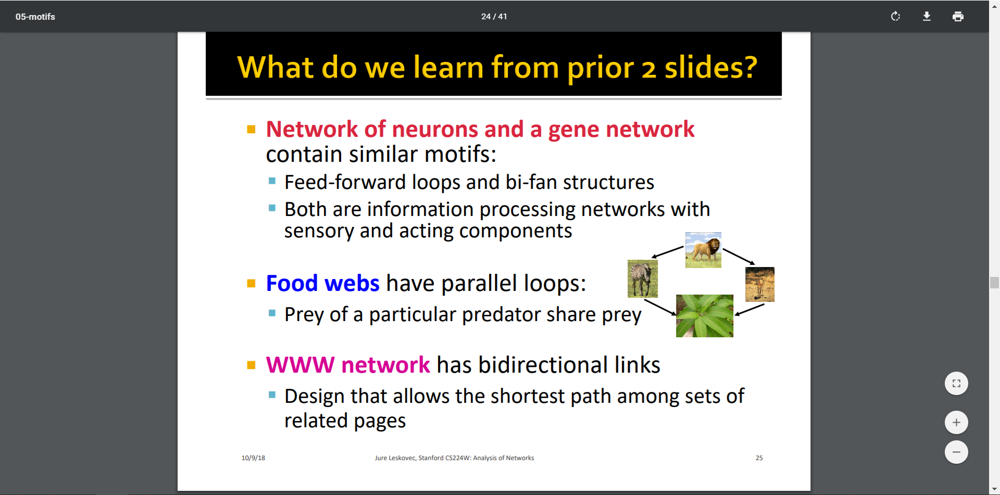

[TOC]

# 1. Network Motifs (网络模体)

生物学定义: 复杂的生物调控网络可以分解为一些基本的结构单元。其中最简单的网络模体是自调控的正反馈和负反馈回路。其他常见的网络模体包括信号级联传导网络（cascade）、反馈环（feedback loops）和前馈环（feed-forward loops）等。这些网络模体是在细胞真实网络中出现频率高的基本单元。

**Significance** of a motif: Subgraphs that occur in a real network **much more often** than in a random network have functional significance.

搞了一个Z打分机制，打分函数SP如下。High Z-score = Subgraph i is a network motif of G.

然后对一些经典的网络拓扑进行了模体检测，主要有三类网络（gene network, food webs, WWW network）:

其中，

**C.elegans(线虫)网络**: This is a neural network of neurons and synapses in *C. elegans*, a type of worm. This dataset also includes two-dimensional spatial positions of the rostral ganglia neurons. 

**E.coli(大肠杆菌)网络**: Transcriptional regulation networks in cells orchestrate gene expression. In this network the 'nodes' are operons, and each 'edge' is directed from an operon that encodes a transcription factor to an operon that it directly regulates (an operon, 核苷酸序列 is one or more genes transcribed on the same mRNA). 

得到的结论:

# 2. Graphlet: Connected Non-isomorphic (非同构) Subgraphs

**Graphlet degree vector** counts #(graphlets) that a node touches at a particular orbit.

> An **automorphism orbit** takes into account the symmetries of a subgraph.
>
> Graphlet Degree Vector (GDV): a vector with the frequency of the node in each orbit position  

Graphlet degree vector provides a measure of a node’s local network topology: Comparing vectors of two nodes provides a highly constraining measure of local topological similarity between them.

Just knowing if a certain subgraph exists in a graph is a hard computational problem!

> Subgraph isomorphism is NP-complete. 
>
> Computation time grows exponentially as the size of the motif/graphlet increases.

## 2.1 ESU算法: Counting Subgraghs (鸽, 关键词: 递归, ESU-Tree)

# 3. 图同构

Graphs G and H are isomorphic if there exists a bijection f: V(G) → V(H) such that: Any two nodes u and v of G are adjacent in G iff f(u) and f(v) are adjacent in H. 