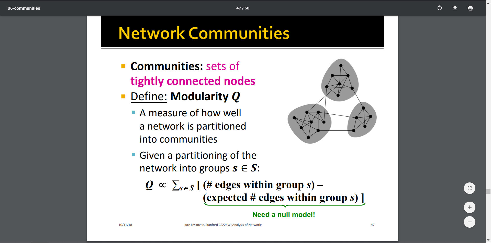

[TOC]

# Title: Community Structure in Networks

## 1. Structural “Roles” in Networks

### 1.1 Roles

Roles are “functions” of nodes in a network, considered as **A collection of nodes which have similar positions in a network**.

**Roles are measured by structural behaviors**: 

- Centers of stars
- Members of cliques
- Peripheral nodes 外围节点

**Roles versus Groups: Roles and Groups are complementary**: 

- Roles: A group of nodes with similar structural properties
- Groups: A group of nodes that are well-connected to each other; Group is formed based on adjacency, proximity or reachability.

### 1.2 Structural Equivalence

**Nodes u and v are structurally equivalent if they have the same relationships to all other nodes**.

 

### 1.3 Structural Roles in Networks 的应用场景

| Task                | Example Application                                          | 我的备注                                                     |
| ------------------- | ------------------------------------------------------------ | ------------------------------------------------------------ |
| Role query          | Identify individuals with similar behavior to a known target | 对于一个给定的网络，识别其中结构相同（功能相同）的节点。     |
| Role outliers       | Identify individuals with unusual behavior                   | 对于一个给定的网络，识别其中的structural outliers            |
| Role dynamics       | Identify unusual changes in behavior                         | 对于一个不断变化的动态网络，识别其中结构的变化。             |
| Identity resolution | Identify/de-anonymize (去匿名化), individuals in a new network | 对于一个新网络，识别/去匿名化其中的节点（确定节点的“语义”？），基于的假设是：结构相似的节点的功能（role）也类似。 |
| Role transfer       | Use knowledge of one network to make predictions in another  |                                                              |
| Network comparison  | Compute similarity of networks, determine compatibility for knowledge transfer |                                                              |

### 1.4 RolX算法: 自动提取网络中的节点角色（无监督学习，无需先验知识）

**RolX算法发现网络中的结构化角色。其中最重要的是 Recursive Feature Extraction [Henderson, et al. 2011a] turns network connectivity into structural features.**

1. Base set of a node’s neighborhood features: 
   1. Local features: degree
   2. Egonet features: **#(within-egonet edges); #(edges entering/leaving egonet)** —— 所谓的ego network，它的节点是由唯一的一个中心节点(ego)，以及这个节点的邻居(alters)组成的，它的边只包括了ego和alter之间，以及alter与alter之间的边。
2. Start with the base set of node features
3. Use the set of current node features to generate additional features. 
   1.  Two types of aggregate functions: means and sums.

存在的问题：The number of possible recursive features grows exponentially with each recursive iteration.

解决方案：**feature pruning** ——  Eliminate one of the features whenever two features are correlated above a user-defined threshold

提取出来的特征可以用来：

1. **Can compare nodes based on their structural similarity**
2. **Can cluster nodes to identify different structural roles —— role extraction** (implemented by non-negative matrix factorization) 

## 2. Roles and Communities

### 2.1 一个有趣的发现: acquaintances are most helpful.

People find the information through personal contacts.  But contacts were often acquaintances rather than close friends. This is surprising because one would expect your friends to help you out more than casual acquaintances.

美国斯坦福大学教授 Granovetter 的[《The strength of weak ties》](https://sociology.stanford.edu/people/faculty/granovetter/documents/TheStrengthofWeakTies.pdf)论文提出了弱联结理论， 该理论认为：弱联结比强连接更能穿越不同的社会群体，因此能触及更多的人，穿过更大的社会距离。 

弱联结理论最重要的假设就是——**三元闭包原则 Triadic Closure**: If two people in a network have a friend in common, then there is an increased likelihood they will become friends themselves.

> 在社交网络的研究中，思考网络如何随时间的推移而演变具有积极的意义，其中特别重要的是导致节点的到达和离开以及边的形成和消失的机制。关于该问题的确切答案需要具体问题具体分析，其中最为基本的原则是：在一个社交圈内，若两个人有一个共同的朋友，则这两个人在未来成为朋友的可能性就会提高，这个原则被称为三元闭包。

**三元闭包的衡量——聚集系数**：节点A的聚集系数定义为A的任意两个朋友彼此也是朋友的概率，某节点附近三元闭包过程越强，其聚集度就越大。

### 2.2 断言: 若节点A满足强三元闭包性质，并有至少两个强联系边与之相连，则与其相连的任何捷径均为弱联系。

捷径与邻里重叠度:

- 若边A-B的端点A和B没有共同朋友，则称边A-B为捷径 (local bridge) ; 删除A-B边将把A-B距离增加至2以上。 定义邻里重叠度(neighborhood overlap):

- 捷径 = 邻里重叠度为0的边 

强联系与弱联系:

- 强联系: 对应朋友(Friend)关系; 弱联系: 对应熟人(Acquaintance)关系
- 若节点A与节点B和C的关系均为强联系，且B和C之间无任何连接，则称节点A违反了强三元闭包性质。否则，称其满足强三元闭包性质。 

## 3. Detection via Modularity Optimization

大写S是对网络的一个划分(partition)，小写s是划分出来的一个个community。

i和j是community s中的节点, A是邻接矩阵。

### 3.1 Louvain algorithm —— identify communities by maximizing modularity (鸽)